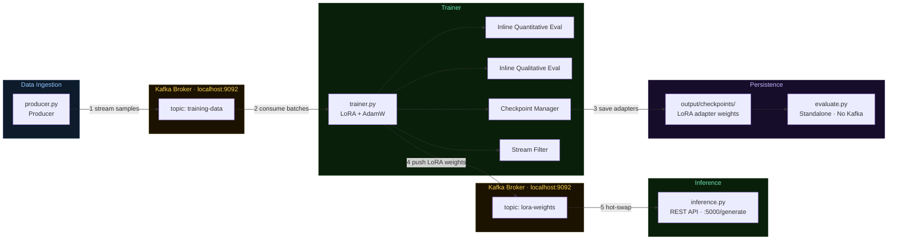

<div align="center">

# InfiniTune
### Realtime LLM Fine-Tuning Framework

[](https://github.com/rohang1411/Infinitune-Realtime-LLM-Fine-Tuning-Framework)
[](https://www.python.org/downloads/)
[](https://pytorch.org/)
[](https://kafka.apache.org/)
[](https://huggingface.co/)
[](https://github.com/psf/black)
[](https://makeapullrequest.com)
[](https://opensource.org/licenses/MIT)

A distributed framework for **continuously fine-tuning Large Language Models in real time** using Kafka data streams and LoRA (Low-Rank Adaptation). As new training data arrives, the model adapts on-the-fly and the inference server receives updated adapter weights automatically — no restarts required.

<br>

**Zero-Downtime Hot-Swaps** &nbsp;|&nbsp; **Consumer Hardware Friendly** &nbsp;|&nbsp; **Live Streaming Data** &nbsp;|&nbsp; **Qualitative & Quantitative Eval**

</div>

---

## Table of Contents

1. [What is InfiniTune?](#what-is-infinitune)
2. [Architecture](#architecture)
3. [Project Structure](#project-structure)
4. [Dependencies](#dependencies)
5. [Kafka Setup](#kafka-setup)
   - [macOS (KRaft mode)](#macos-kraft-mode--no-zookeeper)
   - [Windows (KRaft mode)](#windows-kraft-mode--no-zookeeper)
   - [Windows (Legacy — with Zookeeper)](#windows-legacy--with-zookeeper)
6. [Running InfiniTune](#running-infinitune)
7. [Available Configs](#available-configs)
8. [Checkpoint Saving](#checkpoint-saving)
9. [Evaluation Modes](#evaluation-modes)
10. [Output Directory Structure](#output-directory-structure)

---

## What is InfiniTune?

Traditional fine-tuning requires a static dataset, an offline training run, and a manual deployment step. **InfiniTune removes all three bottlenecks.**

It is built around three decoupled services that communicate over Kafka:

| Service | Script | Role |
|---|---|---|
| **Producer** | `producer.py` | Streams training samples from a HuggingFace dataset to a Kafka topic |
| **Trainer** | `trainer.py` | Consumes data from Kafka, fine-tunes with LoRA, saves checkpoints, and pushes updated adapter weights back to Kafka |
| **Inference Server** | `inference.py` | Loads the base model and LoRA adapter, serves a REST API, and hot-swaps adapter weights in real time |

A fourth standalone script handles post-training evaluation:

| Script | Role |
|---|---|
| `evaluate.py` | Loads any saved checkpoint and runs the full evaluation suite (quantitative + qualitative) without re-training |

**Key properties:**
- **Online (streaming) learning** — the model improves continuously as data flows in
- **Memory-efficient** — LoRA adapters only train a fraction of model parameters
- **Config-driven** — all hyperparameters, dataset settings, and evaluation logic defined in a single YAML file
- **Multi-task** — pre-built configs for IMDb, GSM8K, and Alpaca spanning quantitative and qualitative evaluation
- **Dual evaluation modes** — inline (during training) and decoupled (after training via `evaluate.py`)
- **Versioned outputs** — training logs, checkpoints, and evaluation results are all versioned and never overwrite previous runs

---

## Architecture



### Data Flow

| Step | Service | What happens |
|:---:|---|---|
| **1** | Producer | Reads a HuggingFace dataset, applies filtering and prompt templating, publishes samples to `training-data` topic |
| **2** | Trainer | Consumes batches from Kafka, runs forward + backward passes with LoRA, evaluates inline |
| **3** | Checkpoint Manager | Serialises LoRA adapter weights to disk every N steps and at training end |
| **4** | Trainer | Publishes updated adapter weights to `lora-weights` Kafka topic |
| **5** | Inference Server | Pulls new weights from Kafka and applies them in-place — zero downtime, requests continue uninterrupted |

---

## Project Structure

```
InfiniTune/
├── producer.py                       # Data streaming service
├── trainer.py                        # Training + inline eval + checkpoint saving
├── inference.py                      # REST API + live LoRA weight updates
├── evaluate.py                       # Standalone decoupled evaluation script
│
├── configs/
│   ├── imdb_quantitative.yaml        # IMDb binary sentiment classification
│   ├── gsm8k_quantitative.yaml       # GSM8K math exact-match reasoning
│   ├── alpaca_qualitative.yaml       # Alpaca instruction following (semantic similarity)
│   ├── imdb_qualitative.yaml         # IMDb unconditional generation (keyword density)
│   ├── gsm8k_qualitative.yaml        # GSM8K + structural Chain-of-Thought metrics
│   └── e2e_qualitative.yaml          # E2E structured generation (slot coverage + consistency)
│
├── docs/                             # Per-config testing guides
│   ├── README.md                     # Guide index + config chooser
│   ├── imdb_quantitative_guide.md
│   ├── gsm8k_quantitative_guide.md
│   ├── alpaca_qualitative_guide.md
│   ├── imdb_qualitative_guide.md
│   ├── gsm8k_qualitative_guide.md
│   └── e2e_qualitative_guide.md
│
├── utils/
│   ├── checkpoint_manager.py         # Versioned LoRA adapter save/load
│   ├── eval_metrics_train.py         # Quantitative evaluation (Evaluator class)
│   ├── eval_qualitative.py           # Qualitative evaluation (strategies + orchestrator)
│   ├── plot_metrics.py               # Standalone evaluation artifact regeneration utility
│   └── stream_filter.py              # Kafka data quality filtering
│
├── output/                           # All generated artefacts (git-ignored)
│   └── <project>/
│       ├── checkpoints/              # Saved LoRA adapters
│       ├── logs/                     # Training metrics CSVs + evaluation artifacts
│       └── eval_results/             # Decoupled evaluation results
│
└── requirements.txt
```

---

## Dependencies

### System Requirements

| Requirement | Version |
|---|---|
| Python | 3.9+ |
| Apache Kafka | 3.3+ (KRaft mode) or 4.x |
| Java JDK | 11+ (required by Kafka) |

### Python Packages

```bash
pip install -r requirements.txt
```

| Package | Purpose |
|---|---|
| `torch` | Model training and inference |
| `transformers` | HuggingFace model/tokenizer loading |
| `peft` | LoRA adapter implementation |
| `datasets` | HuggingFace dataset loading |
| `kafka-python` | Kafka producer/consumer client |
| `flask` | REST API for the inference server |
| `accelerate` | Device-aware model loading |
| `matplotlib` | Training metrics plots |
| `sentence-transformers` | Semantic similarity evaluation (MiniLM, CPU-only) |
| `jinja2` | Prompt and response templating |

> **Apple Silicon (M-series):** PyTorch MPS backend is used automatically. All qualitative metrics run on CPU and do not compete for MPS memory. Models load in `fp16` automatically.

---

## Kafka Setup

### macOS (KRaft mode — No Zookeeper)

```bash
# Install
brew install kafka

# Add to PATH (add to ~/.zshrc)
export PATH="/opt/homebrew/opt/kafka/bin:$PATH"
source ~/.zshrc

# Format storage (one-time only)
KAFKA_CLUSTER_ID="$(kafka-storage random-uuid)"
kafka-storage format -t $KAFKA_CLUSTER_ID -c /opt/homebrew/etc/kafka/server.properties

# Start / stop
brew services start kafka
brew services stop kafka

# Verify
kafka-topics --bootstrap-server localhost:9092 --list
```

> If you see `"Log directory is already formatted"` during the format step, skip it — storage is already initialised.

---

### Windows (KRaft mode — No Zookeeper)

**1.** Download and install **JDK 11+** from [adoptium.net](https://adoptium.net/). Set `JAVA_HOME`.

**2.** Download the latest Kafka binary from [kafka.apache.org/downloads](https://kafka.apache.org/downloads) and extract to `C:\kafka`.

**3.** Format storage (one-time):
```bat
cd C:\kafka
.\bin\windows\kafka-storage.bat random-uuid
```
Copy the UUID output, then:
```bat
.\bin\windows\kafka-storage.bat format -t <YOUR_UUID> -c .\config\server.properties
```

**4.** Start Kafka:
```bat
.\bin\windows\kafka-server-start.bat .\config\server.properties
```

**5.** Verify:
```bat
.\bin\windows\kafka-topics.bat --bootstrap-server localhost:9092 --list
```

---

### Windows (Legacy — with Zookeeper)

> Use only for Kafka < 3.3.

```bat
# Terminal 1
.\bin\windows\zookeeper-server-start.bat .\config\zookeeper.properties

# Terminal 2
.\bin\windows\kafka-server-start.bat .\config\server.properties
```

---

## Running InfiniTune

Open **3 terminals** in the project root and start them in this order.

**Terminal 1 — Inference Server** *(start first — listens for weight updates)*
```bash
python inference.py --config configs/imdb_quantitative.yaml
```

**Terminal 2 — Trainer** *(waits for data from Kafka)*
```bash
python trainer.py --config configs/imdb_quantitative.yaml
```

> Wait until the trainer logs `>>> Start the producer now (if not already running). <<<`

**Terminal 3 — Producer** *(streams training data)*
```bash
python producer.py --config configs/imdb_quantitative.yaml
```

**Test the API:**
```bash
curl -s -X POST http://localhost:5000/generate \
  -H "Content-Type: application/json" \
  -d '{"prompt": "Review: This movie was absolutely incredible.\nSentiment:"}' \
  | python3 -m json.tool
```

Replace `imdb_quantitative.yaml` with any config from the table below.

---

## Available Configs

| Config | Task | Model | Eval Type | Guide |
|---|---|---|---|---|
| `imdb_quantitative.yaml` | Sentiment classification | `distilgpt2` | Accuracy · F1 · MCC | [Guide](docs/imdb_quantitative_guide.md) |
| `gsm8k_quantitative.yaml` | Math reasoning | `Qwen/Qwen2.5-3B` | Exact Match | [Guide](docs/gsm8k_quantitative_guide.md) |
| `alpaca_qualitative.yaml` | Instruction following | `Qwen/Qwen2.5-1.5B` | Semantic Similarity | [Guide](docs/alpaca_qualitative_guide.md) |
| `imdb_qualitative.yaml` | Domain review generation | `Qwen/Qwen2.5-1.5B` | Keyword Density + TTR | [Guide](docs/imdb_qualitative_guide.md) |
| `gsm8k_qualitative.yaml` | Math + CoT structure | `Qwen/Qwen2.5-3B` | Exact Match + CoT Anchors | [Guide](docs/gsm8k_qualitative_guide.md) |
| `e2e_qualitative.yaml` | Structured NLG | `gpt2-medium` | Slot Coverage + Consistency | [Guide](docs/e2e_qualitative_guide.md) |

> Each guide contains step-by-step run instructions, metric definitions, learning curve interpretation, decoupled eval commands, and troubleshooting notes. Read the relevant guide before running a config for the first time.

---

## Checkpoint Saving

During training, **only the LoRA adapter weights** are saved (~5–20 MB per checkpoint, not the full model).

**Each checkpoint contains:**

| File | Contents |
|---|---|
| `adapter_model.safetensors` | LoRA adapter weights |
| `adapter_config.json` | PEFT adapter configuration |
| `checkpoint_meta.json` | Step, timestamp, model name, dataset, loss |

**Directory layout:**
```
output/<project>/checkpoints/<model>__<dataset>/
    step_000100/
    step_000200/
    ...
    final/          # always saved at training end
```

> Step directories are **never overwritten**. The `final/` checkpoint always reflects the latest run endpoint.

**Config:**
```yaml
training:
  save_checkpoints:
    enabled: true
    save_every_steps: 100
    save_final: true
```

---

## Evaluation Modes

InfiniTune has two independent evaluation modes:

### Inline Evaluation (during training)

Runs automatically inside `trainer.py` at configurable step intervals. Writes results to `metrics.csv` and generates versioned plot and dashboard bundles at training end.

```yaml
evaluation:
  enabled: true
  decoupled: false   # false = inline | true = skip inline for maximum speed
```

### Decoupled Evaluation (after training)

Run `evaluate.py` against any saved checkpoint. No Kafka required. Evaluates the full pool for definitive scores.

```bash
# Evaluate final checkpoint
python evaluate.py --config configs/imdb_quantitative.yaml

# Evaluate a specific step
python evaluate.py --config configs/imdb_quantitative.yaml --step 500

# Evaluate ALL checkpoints and produce combined CSV + plots
python evaluate.py --config configs/imdb_quantitative.yaml --all-checkpoints

# List available checkpoints
python evaluate.py --config configs/imdb_quantitative.yaml --list
```

Results saved to: `output/<project>/eval_results/<model>__<dataset>/<checkpoint>/eval_<timestamp>_<uid>/`

> See the per-config guide in [`docs/`](docs/README.md) for exact commands and expected output for each configuration.

**PowerShell helpers — regenerate artifacts from the latest run:**

```powershell
# Latest inline training run
$Config  = "configs/imdb_quantitative.yaml"
$LogRoot = "output/imdb/logs/infinitune-imdb-sentiment"
$Run = Get-ChildItem $LogRoot -Directory | Sort-Object LastWriteTime -Descending | Select-Object -First 1
$Csv = Join-Path $Run.FullName "metrics_clean.csv"
if (-not (Test-Path $Csv)) { $Csv = Join-Path $Run.FullName "metrics.csv" }
python utils/plot_metrics.py $Csv --config $Config

# Latest single-checkpoint decoupled eval
$Config   = "configs/imdb_quantitative.yaml"
$EvalRoot = "output/imdb/eval_results/distilgpt2__imdb"
$EvalRun = Get-ChildItem $EvalRoot -Directory -Recurse | Where-Object { $_.Name -like "eval_*" } | Sort-Object LastWriteTime -Descending | Select-Object -First 1
$Csv = Join-Path $EvalRun.FullName "plots\eval_metrics.csv"
python utils/plot_metrics.py $Csv --config $Config

# Latest all-checkpoints comparison
$Config   = "configs/imdb_quantitative.yaml"
$EvalRoot = "output/imdb/eval_results/distilgpt2__imdb\all_checkpoints"
$EvalRun = Get-ChildItem $EvalRoot -Directory | Sort-Object LastWriteTime -Descending | Select-Object -First 1
$Csv = Join-Path $EvalRun.FullName "all_checkpoints_results.csv"
python utils/plot_metrics.py $Csv --config $Config
```

---

## Output Directory Structure

```
output/<project>/
│
├── checkpoints/<model>__<dataset>/
│   ├── step_000100/
│   │   ├── adapter_model.safetensors
│   │   ├── adapter_config.json
│   │   └── checkpoint_meta.json
│   └── final/
│
├── logs/<project-name>/<timestamp>_<uuid>/
│   ├── metrics.csv
│   ├── metrics_clean.csv
│   ├── run_params.json
│   └── evaluation_artifacts/
│       ├── index.json
│       └── artifact_<timestamp>_<uid>/
│           ├── manifest.json
│           ├── generation_log.json
│           ├── metrics/
│           ├── dashboards/
│           │   ├── dashboard_dark.png
│           │   └── dashboard_light.png
│           ├── insights/
│           ├── plots/
│           └── report.html
│
└── eval_results/<model>__<dataset>/<checkpoint>/eval_<timestamp>_<uid>/
    ├── eval_results.json
    ├── eval_config.json
    └── evaluation_artifacts/
        ├── index.json
        └── artifact_<timestamp>_<uid>/
            ├── manifest.json
            ├── metrics/
            ├── dashboards/
            ├── insights/
            ├── plots/
            └── report.html
```

**No-overwrite guarantees:**
- Training logs use a unique `<timestamp>_<uuid>` directory per run
- Step checkpoints are never overwritten
- Each `evaluate.py` invocation creates a new timestamped directory
