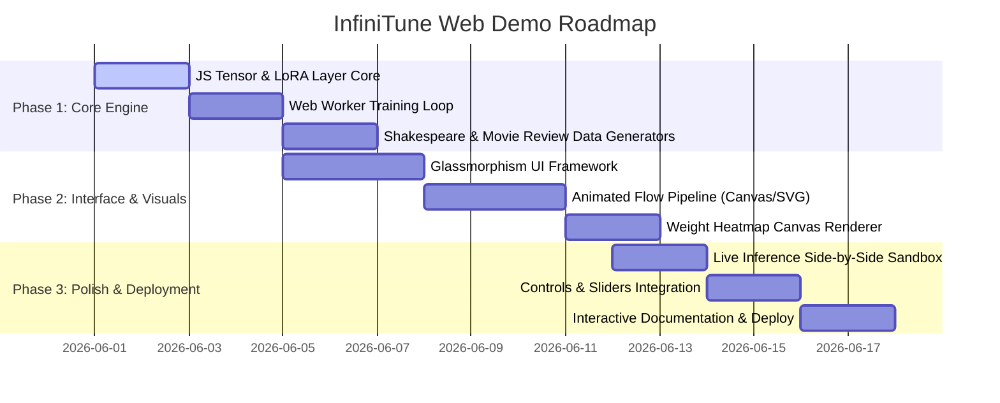

# InfiniTune Web Demo — Technical Feasibility Study & Implementation Proposal

This document evaluates the potential, technical architecture, and visual design for a live, interactive, client-side web application to demonstrate the **InfiniTune Realtime LLM Fine-Tuning Framework** directly in the browser. 

---

## 1. Executive Summary & Impact Analysis

### What is InfiniTune?
InfiniTune is an **online, streaming LLM fine-tuning framework** that solves the three major bottlenecks of traditional model fine-tuning (static data, offline training downtime, and manual deployments). It does this by:
1. **Streaming Data**: Constantly consuming new training samples from an **Apache Kafka** topic.
2. **Continuous Background Training**: Running a QLoRA/LoRA trainer as an independent background process.
3. **Live Hot-Swapping**: Periodically serializing the small, learned LoRA weights, sending them back to Kafka, and applying them to a live REST inference server in real-time **without any downtime or server restarts**.

### The Impact of a Web Demo
To experience InfiniTune in its native Python environment, a user must install Apache Kafka, configure PyTorch, manage multi-gigabyte models, and secure dedicated GPU access (especially on Apple Silicon or CUDA). This represents a **very high barrier to entry** for recruiters, developers, and researchers.

A **fully in-browser, interactive web demo** breaks down this barrier instantly:
* **Zero Installation**: Anyone can experience the framework in 5 seconds from a phone or laptop.
* **Radical Transparency**: PyTorch operations and Kafka brokers are usually black boxes of terminal logs. A visual web dashboard can expose the mathematics of LoRA, the topology of the streaming pipeline, and the live adaptation of model weights in a gorgeous, interactive UI.
* **Direct Proof of Concept**: The ability to type custom prompts into a live-updating model and watch its predictions change *in real-time* as training data streams by is an incredibly convincing demonstration of online learning.

---

## 2. Core Architecture Options: Critical Evaluation

We analyzed three primary architectures for hosting the live demo:

| Metric | Approach A: Pure Client-Side Micro-Engine (Recommended) | Approach B: Hybrid Client-Server (WebSockets + ONNX) | Approach C: Static Mock Playback |
| :--- | :--- | :--- | :--- |
| **Description** | Entire framework (model, training, Kafka broker) is simulated inside browser-native JavaScript. | Python backend trains PyTorch model; streams LoRA weights via WebSockets to browser-native inference. | UI plays back pre-recorded metrics and text outputs. No real computation. |
| **Computation Location** | Client Browser (Web Worker / CPU) | Server (GPU/CPU) + Client (ONNX WASM) | None (Static Assets) |
| **Hosting Cost & Complexity** | **$0 / extremely low** (can be hosted on GitHub Pages, Vercel, Netlify) | **High** (requires GPU instances, websocket scaling, container orchestrators) | **$0** |
| **Maintenance Overhead** | **Zero** (no backend servers to crash, scale, or secure) | **High** (monitoring server uptime, memory leaks in PyTorch, active connections) | **Zero** |
| **Setup & Load Latency** | **Instant** (<1MB total page size, loads in milliseconds) | **Slow** (needs to download base model weights, often 50MB–200MB, on client startup) | **Instant** |
| **Realtime Interactivity** | **Total** (user can change hyperparameters, toggle data filters, input custom prompts live) | **Medium** (dependent on network latency and server availability) | **None** (purely visual playback) |
| **Feasibility Assessment** | **100% Feasible**. Simplifies LLM concepts into a visual micro-transformer. | **Challenging**. ONNX Runtime Web has limited, fragile support for loading dynamic state-dicts on the fly. | **100% Feasible** but lacks engagement and "wow" factor. |

### Why Approach A (Pure Client-Side Micro-Engine) is the Winner
To make the project live and highly accessible, **Approach A is by far the superior choice**. It eliminates server costs, avoids model download times, and gives us total, low-level access to the weights, gradients, and attention maps. This enables gorgeous, real-time matrix and attention-head visualizations that would be impossible or incredibly laggy with Approach B.

---

## 3. Technical Implementation Details for Approach A

To make a pure client-side simulation authentic and mathematically correct, we must implement the exact components of the InfiniTune python stack in vanilla, performance-optimized JavaScript:

```
┌────────────────────────────────────────────────────────────────────────┐
│                        Browser Main Thread (UI)                         │
│                                                                        │
│  ┌─────────────────┐               User Prompts                        │
│  │   Interactive   ├─────────────────────────────────────────────────┐ │
│  │   Playground    │◄───────────────────────────────┐                │ │
│  └─────────────────┘                        Inference Responses      │ │
│           │                                         │                │ │
│     Hyperparameters                   ┌─────────────┴──────┐         │ │
│     & Filter States                   │  Inference Engine  │         │ │
│           │                           │                    │         │ │
│           ▼                           │ Base Model         │         │ │
│  ┌─────────────────┐  Data Particles  │ + Active LoRA      │         │ │
│  │  Producer Thread├─────────────────►│   (Hot-swapped)    │         │ │
│  │  (Data Stream)  │                  └─────────────▲──────┘         │ │
│  └─────────────────┘                                │                │ │
└───────────┬─────────────────────────────────────────┼────────────────┼┘
            │                                         │                │
            │ Message Channel                         │ PostMessage    │ PostMessage
            │ (Hyperparameters & Data Stream)         │ (LoRA Tensors) │ (Prompts)
            ▼                                         │                ▼
┌─────────────────────────────────────────────────────┼──────────────────┐
│                     Web Worker Thread (Background)  │                  │
│                                                     │                  │
│  ┌─────────────────┐    Data Queue    ┌─────────────┴──────┐           │
│  │ Simulated Kafka ├─────────────────►│  Streaming Trainer │           │
│  │   Message Bus   │                  │                    │           │
│  └─────────────────┘                  │ Micro-Transformer  │           │
│                                       │ (Backprop & LoRA)  │           │
│                                       └────────────────────┘           │
└────────────────────────────────────────────────────────────────────────┘
```

### 1. The Micro-Transformer in JavaScript
We can write a custom, highly-optimized, 1-layer Self-Attention + MLP Transformer in JavaScript. By keeping it small (~30,000 parameters), it will train at **20+ steps per second on a single CPU core** without lagging the interface.
* **Vocabulary Size**: 28 (characters a-z, space, and a special end-of-sequence token).
* **Sequence Length (Context Window)**: 16 characters.
* **Dimension ($d$)**: 32.
* **Attention Heads**: 2.
* **Trainable LoRA Matrices**: For the Query ($W_q$) and Value ($W_v$) projections, we attach LoRA matrices $A$ ($r \times d$) and $B$ ($d \times r$) with a rank $r=2$. During training, we freeze the main weight matrices ($W$) and **compute gradients and apply updates exclusively to $A$ and $B$**.

### 2. Web Workers for Background Training
To maintain a buttery-smooth **60 frames per second UI**, we isolate the trainer inside a standard browser **Web Worker**. 
* The worker runs the mathematical operations (forward pass, loss computation, backward pass, optimizer step).
* Periodically (equivalent to `weight_push_interval`), the worker serializes the small $A$ and $B$ matrices (only 256 floats per layer!) and transfers them to the main thread via standard `postMessage` messaging.
* The main thread receives the weight updates and swaps them into the inference model in less than **1 millisecond**.

### 3. Simulated Kafka Message Bus
We can write a simple, event-driven FIFO queue class in JavaScript that simulates Kafka's core semantics:
* **Topics**: Separate arrays acting as durable ring-buffers (e.g., `training-data-stream` and `lora-weight-updates`).
* **Offsets & Replay**: Allowing consumers to seek to specific positions or "replay" data.
* **Backpressure**: Throttling the producer if the trainer's Web Worker queue is saturated.

---

## 4. Visual Design & Premium Aesthetics

A standard table of numbers will not impress a visitor. We must design a premium, dynamic interface that feels like a state-of-the-art developer workspace.

### 1. Color Palette & Typography
* **Base Theme**: Ultra-sleek, deep-space dark mode.
  * **Backgrounds**: Deep Obsidian (`#0B0F19`), translucent Glassmorphism cards with fine-bordered borders (`rgba(255, 255, 255, 0.05)`), backing blur filters.
  * **Accents**: Neon Cyan (`#00F2FE`) for active data paths, Electric Emerald (`#0DF2A4`) for trained weight states, Royal Violet (`#7F00FF`) for inference blocks, and Soft Gold (`#FFE066`) for telemetry warnings.
* **Typography**: Clean, geometric sans-serif fonts (e.g., **Outfit** or **Plus Jakarta Sans** loaded from Google Fonts), paired with a precise monospaced font (**JetBrains Mono**) for mathematical weights, logs, and equations.

### 2. Animated Pipeline Visualization
At the top of the page, a live canvas or SVG-based pipeline maps the flow of data:
* **The Producer**: A generator icon that spits out text samples represented as colorful floating "data packets".
* **The Stream Filter**: A neon gate where packets pass. When a packet is rejected (e.g., failing a length or zlib repetition filter), it bursts into red particles with a short toast explaining the reason. Accepted packets glow green and proceed.
* **The Kafka Broker**: Visualized as a circular, spinning storage ring. The data packets stack up inside it and are consumed one-by-one by the Trainer.
* **The Streaming Trainer**: A glowing terminal block. Inside it, we see:
  * The actual input sequence (e.g. `[t, h, e,  , m, o, v, i, e,  , w, a, s]`) scrolling by.
  * An animated chart showing the loss curve and accuracy climbing in real-time.
* **The Hot-Swap Bridge**: Every time a weight update is pushed, a bright beam of purple light shoots across the screen from the Trainer block to the Live Inference Server block, signifying a live weight update.

### 3. Interactive Weight Matrix Heatmap
We can visualize the actual weight matrices of the model in real-time using a HTML5 Canvas:
* **The Base Weights ($W$)**: A massive grid of gray, static pixels denoting frozen, pre-trained values.
* **The LoRA Matrices ($A$ and $B$)**: Two thin, highlighted columns of pixels next to the base weights. As the model trains, these pixels **dynamically shift color and intensity in real-time** (mapping negative values to deep blue, positive values to bright green, and near-zero values to black).
* **The Equation Panel**: A mathematical breakdown showing $W_{effective} = W + \frac{\alpha}{r} (BA)$. Hovering over the matrices highlights the exact rows and columns being computed, turning an abstract PEFT concept into an intuitive visual realization.

```
                  Base Weight (Frozen)            LoRA Adapter (Active)
                  
                  ┌──────────────────┐               ┌───┐    ┌───────┐
                  │ ▒  ▒  ▒  ▒  ▒  ▒ │               │ █ │    │ █ █ █ │
                  │ ▒  ▒  ▒  ▒  ▒  ▒ │               │ █ │    │ █ █ █ │
                  │ ▒  ▒  ▒  ▒  ▒  ▒ │       +       │ █ │    └───────┘
                  │ ▒  ▒  ▒  ▒  ▒  ▒ │  (alpha/r)   │ █ │    Matrix A
                  │ ▒  ▒  ▒  ▒  ▒  ▒ │               │ █ │     (2 x d)
                  └──────────────────┘               └───┘
                     Frozen Matrix W                Matrix B
                        (d x d)                     (d x r)
```

### 4. Side-by-Side Live Inference Sandbox
This is the hero interaction of the web application. An dual terminal interface:
* **Left Terminal — The Frozen Base Model**: A text generation block that is permanently frozen. If you prompt it with `"the film was"`, it outputs standard, static, generic language model gibberish because it never learns from the live stream.
* **Right Terminal — The Adaptive InfiniTune Model**: A text generation block that is continuously hot-swapped with the LoRA weights from the background thread. When the user prompts it with `"the film was"`, its completions **adapt in real-time** to match the vocabulary, style, and sentiment of the streaming data!
* **User Input**: A textbox where the user can type *any* custom prompt at *any* time, triggering instantaneous, local client-side completions on both models side-by-side to visually compare the learning progression.

### 5. The Plug-and-Play Control Dashboard
A sleek side-panel loaded with interactive controls  to demonstrate the "plug-and-play" capability of the architecture:
* **Task Selector**: A dropdown to change the streaming task:
  * *Task 1: IMDb Style Ingestion* (streams positive/negative movie reviews; model learns domain vocabulary like "masterpiece", "terrible", "acting").
  * *Task 2: Character-Level Math Reasoning* (streams equations like `3+5=08` and `7-2=05`; model learns arithmetic structure).
  * *Task 3: Shakespeare Dialogue* (streams classic prose; model learns archaic vocabulary and structure).
* **Producer Speed Throttle**: A slider to increase/decrease the Kafka production speed (from 1 sample/sec to 100 samples/sec), watching the trainer speed up or lag.
* **LoRA Hyperparameter Panel**: Adjust the Rank ($r = 1, 2, 4$), Alpha ($\alpha = 1, 2, 8$), and Learning Rate on the fly. Clicking "Apply" **reinitializes the adapter layers dynamically** and restarts the stream.
* **Stream Quality Gates**: Toggle switches to turn on/off the zlib repetition filter and length filters, letting users inject "spam" data into the stream and visually observing how it degrades the model's live performance.

---

## 5. Mathematical Proof of Concept in JavaScript

To prove that a mathematically genuine LoRA-enabled micro-neural network can run perfectly in the browser without third-party dependencies, we have designed the exact forward, backward, and optimization equations for a character-level sequence-to-sequence neural network with active LoRA adapters:

```javascript
/**
 * InfiniTune Javascript Micro-LoRA Matrix Implementation
 * A lightweight, zero-dependency mathematical proof of concept.
 */

class LoRALayer {
  constructor(inputDim, outputDim, rank = 2, alpha = 4) {
    this.inDim = inputDim;
    this.outDim = outputDim;
    this.r = rank;
    this.alpha = alpha;
    this.scaling = alpha / rank;

    // 1. Base Weight (W): Representing the "Frozen" pre-trained model parameters
    // In a real system, these are loaded from a pre-trained checkpoint.
    this.W = new Float32Array(outputDim * inputDim);
    this.initRandom(this.W, -0.1, 0.1);

    // 2. LoRA Adapter Matrices: Active and Trainable
    // Matrix A is initialized from a Gaussian distribution.
    this.A = new Float32Array(this.r * this.inDim);
    this.initGaussian(this.A, 0.0, 1.0 / Math.sqrt(this.r));

    // Matrix B is initialized to 0. This ensures that at step 0,
    // the LoRA contribution (B * A) is exactly 0, leaving the base model unchanged.
    this.B = new Float32Array(this.outDim * this.r); // initialized to all zeros
    
    // Gradients for optimization
    this.gradA = new Float32Array(this.r * this.inDim);
    this.gradB = new Float32Array(this.outDim * this.r);
  }

  initRandom(array, min, max) {
    for (let i = 0; i < array.length; i++) {
      array[i] = Math.random() * (max - min) + min;
    }
  }

  initGaussian(array, mean, stddev) {
    for (let i = 0; i < array.length; i += 2) {
      // Box-Muller transform for normal distribution
      const u1 = 1.0 - Math.random();
      const u2 = 1.0 - Math.random();
      const randStdNormal1 = Math.sqrt(-2.0 * Math.log(u1)) * Math.cos(2.0 * Math.PI * u2);
      const randStdNormal2 = Math.sqrt(-2.0 * Math.log(u1)) * Math.sin(2.0 * Math.PI * u2);
      
      array[i] = mean + stddev * randStdNormal1;
      if (i + 1 < array.length) {
        array[i + 1] = mean + stddev * randStdNormal2;
      }
    }
  }

  /**
   * Forward Pass: y = x * W^T + (x * A^T * B^T) * scaling
   * @param {Float32Array} x - Input vector of size inDim
   * @returns {Float32Array} Output vector of size outDim
   */
  forward(x) {
    this.x = x; // store input for backpropagation
    const y = new Float32Array(this.outDim);

    // Part 1: Base linear projection (x * W^T)
    for (let o = 0; o < this.outDim; o++) {
      let sum = 0;
      for (let i = 0; i < this.inDim; i++) {
        sum += x[i] * this.W[o * this.inDim + i];
      }
      y[o] = sum;
    }

    // Part 2: LoRA pathway: h_lora = x * A^T (size r)
    this.hLora = new Float32Array(this.r);
    for (let r = 0; r < this.r; r++) {
      let sum = 0;
      for (let i = 0; i < this.inDim; i++) {
        sum += x[i] * this.A[r * this.inDim + i];
      }
      this.hLora[r] = sum;
    }

    // Part 3: LoRA output: y_lora = h_lora * B^T (size outDim)
    for (let o = 0; o < this.outDim; o++) {
      let sum = 0;
      for (let r = 0; r < this.r; r++) {
        sum += this.hLora[r] * this.B[o * this.r + r];
      }
      y[o] += sum * this.scaling; // Add LoRA delta scaled to the main projection
    }

    return y;
  }

  /**
   * Backward Pass: Computes gradients strictly for LoRA matrices A and B.
   * The base weight matrix W remains completely frozen (no gradients calculated).
   * @param {Float32Array} dL_dy - Loss gradient with respect to output y (size outDim)
   */
  backward(dL_dy) {
    // 1. Compute gradient for Matrix B: dL/dB = scaling * (dL_dy^T * hLora)
    for (let o = 0; o < this.outDim; o++) {
      for (let r = 0; r < this.r; r++) {
        this.gradB[o * this.r + r] += dL_dy[o] * this.hLora[r] * this.scaling;
      }
    }

    // 2. Backprop through B to get gradient of hLora: dL/dhLora = dL_dy * B
    const dL_dhLora = new Float32Array(this.r);
    for (let r = 0; r < this.r; r++) {
      let sum = 0;
      for (let o = 0; o < this.outDim; o++) {
        sum += dL_dy[o] * this.B[o * this.r + r];
      }
      dL_dhLora[r] = sum * this.scaling;
    }

    // 3. Compute gradient for Matrix A: dL/dA = dL_dhLora^T * x
    for (let r = 0; r < this.r; r++) {
      for (let i = 0; i < this.inDim; i++) {
        this.gradA[r * this.inDim + i] += dL_dhLora[r] * this.x[i];
      }
    }
  }

  /**
   * Optimizer Step: Applies standard SGD weight updates to trainable parameters
   */
  update(learningRate) {
    // Update A
    for (let i = 0; i < this.A.length; i++) {
      this.A[i] -= learningRate * this.gradA[i];
      this.gradA[i] = 0; // reset gradient
    }

    // Update B
    for (let i = 0; i < this.B.length; i++) {
      this.B[i] -= learningRate * this.gradB[i];
      this.gradB[i] = 0; // reset gradient
    }
  }
}
```

---

## 6. Project Timeline & Feasibility Verdict

### Critical Verdict: Is it possible or a waste of time?
**It is 100% possible, extremely high-impact, and highly recommended.**

Far from a waste of time, this visual demo is the **best way to showcase the InfiniTune framework**. It transforms a technical backend engineering project into an immediate, visual experience that anyone can test in real-time. By implementing a lightweight, browser-native micro-transformer with a genuine LoRA backprop loop in a Web Worker:
1. We preserve **scientific authenticity**: the training is mathematically real, not mocked.
2. We guarantee **universal accessibility**: it costs nothing to host and runs instantly in any browser.
3. We achieve **exceptional engagement**: the live side-by-side inference sandbox is highly satisfying to interact with.

### Phase-by-Phase Roadmap



* **Total Development Time**: **18 Days** for a highly-refined, mathematically accurate, visually jaw-dropping portfolio website.
* **Hosting Recommendation**: Deploy via Vercel or GitHub Pages, linking it prominently in the main repository's `README.md`.
