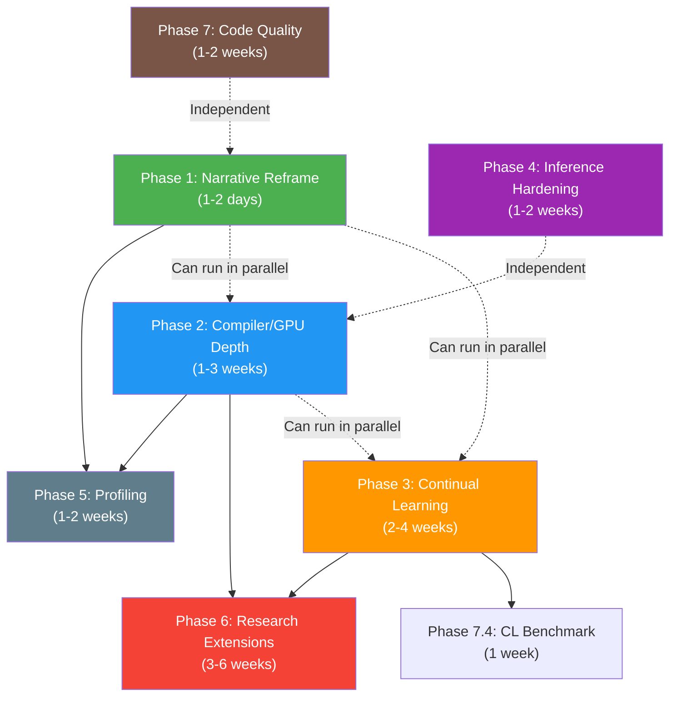

# InfiniTune — Master Implementation Plan

> **Version:** 1.1  
> **Created:** 2026-06-16  
> **Last Updated:** 2026-06-16  
> **Purpose:** A comprehensive, self-contained implementation plan for transforming InfiniTune from a strong MLOps/streaming-training demo into a **research-grade, production-quality online continual-learning system for LLMs** — the kind of system that senior AI engineers at NVIDIA, Google DeepMind, or Meta FAIR would build, review, and respect.
>
> **Design Philosophy:** Every change must be **correct, logical, and purposeful** — not cosmetic. Each item exists because it addresses a concrete technical gap identified through analysis, not because it looks good on a checklist. Changes that would introduce complexity without measurable benefit are explicitly excluded.
>
> **Cardinal Rule:** This framework took significant time and effort to build. **Nothing in this plan may break existing functionality.** Every modification is additive or opt-in. Existing configs, existing outputs, existing workflows must continue to work exactly as they do today.

---

## Table of Contents

1. [Executive Summary](#1-executive-summary)
2. [Zero-Breakage Guarantee & Code Change Safety](#2-zero-breakage-guarantee--code-change-safety)
3. [Documentation Discipline](#3-documentation-discipline)
4. [Current State Assessment](#4-current-state-assessment)
5. [Strategic Vision & Positioning](#5-strategic-vision--positioning)
6. [Perfect Use Cases for InfiniTune](#6-perfect-use-cases-for-infinitune)
7. [Phase 1 — Narrative & Documentation Reframe](#7-phase-1--narrative--documentation-reframe)
8. [Phase 2 — Compiler, GPU & Precision Depth](#8-phase-2--compiler-gpu--precision-depth)
9. [Phase 3 — Continual Learning Algorithms](#9-phase-3--continual-learning-algorithms)
10. [Phase 4 — Production Inference Hardening](#10-phase-4--production-inference-hardening)
11. [Phase 5 — Observability, Profiling & Benchmarking](#11-phase-5--observability-profiling--benchmarking)
12. [Phase 6 — Advanced Research Extensions](#12-phase-6--advanced-research-extensions)
13. [Phase 7 — Code Quality & Infrastructure](#13-phase-7--code-quality--infrastructure)
14. [Anti-Patterns — What NOT to Do](#14-anti-patterns--what-not-to-do)
15. [Dependency & Ordering Map](#15-dependency--ordering-map)
16. [Risk Registry & Mitigation](#16-risk-registry--mitigation)
17. [Verification Strategy](#17-verification-strategy)
18. [File-by-File Change Map](#18-file-by-file-change-map)
19. [Prioritized Execution Roadmap](#19-prioritized-execution-roadmap)

---

## 1. Executive Summary

> [!CAUTION]
> **This framework represents significant engineering investment. The #1 constraint on every change in this plan is: DO NOT BREAK EXISTING FUNCTIONALITY.** All new features are additive and opt-in. See §2 for the full Zero-Breakage protocol and §3 for the Documentation Discipline that ensures changes are tracked and explained.

InfiniTune is already a **well-engineered streaming ML system** with genuine production-grade scar tissue: Kafka-mediated decoupled services, zero-downtime LoRA hot-swap, hierarchical checkpointing, a mature multi-strategy evaluation harness with continual-learning metrics (AAUC, backward transfer, forgetting-max), and real engineering hardening (MPS memory management, consumer timeout tuning, UUID isolation).

**However, two critical depth gaps prevent it from being top-tier:**

1. **The learning algorithm is shallow.** The training loop is vanilla AdamW SFT over a Kafka queue. There is no forgetting mitigation, no drift detection, no safety guardrails on live updates. The system *measures* catastrophic forgetting (backward transfer, forgetting-max) without *fixing* it.

2. **There is no hardware/compiler depth.** No `torch.compile`, no mixed-precision AMP, no kernel optimization, no profiling. The precision policy is "fp32 everywhere because MPS had NaN issues" — correct for stability, but it leaves the massive throughput/memory wins of BF16/FP8/torch.compile on the table for CUDA users.

**This plan closes both gaps** across 7 phases, ordered by (impact ÷ effort). Each phase is independently shippable and produces a concrete deliverable. The minimum viable upgrade (Phases 1–3) transforms the project from "nice MLOps demo" to "systems + research depth" in approximately 4–6 weeks.

---

## 2. Zero-Breakage Guarantee & Code Change Safety

> [!IMPORTANT]
> This framework took a lot of time to build. Nothing in this plan is worth shipping if it breaks what already works. This section defines the non-negotiable rules for how code changes are made.

### 2.1 The Zero-Breakage Contract

**Every change in this plan MUST satisfy ALL of the following:**

1. **Existing configs run identically.** All 6 existing YAML configs (`imdb_quantitative`, `imdb_qualitative`, `gsm8k_quantitative`, `gsm8k_qualitative`, `alpaca_qualitative`, `e2e_qualitative`) must produce the same training behavior, evaluation results, and output structure as they do today — byte-for-byte on the same seed.

2. **New features are opt-in via config.** Every new capability (torch.compile, AMP, OPLoRA, drift detection, Liger Kernel, etc.) is disabled by default (`enabled: false`). A user who upgrades InfiniTune and runs their existing config sees zero behavioral change.

3. **No existing file is deleted or renamed.** Files can be modified (carefully, see §2.3) or new files added. Removing a file means someone's workflow breaks.

4. **No existing function signature changes.** If `tokenize_with_label_masking(tokenizer, prompt_text, response_text, max_seq_length)` works today, it must accept the same arguments tomorrow. New parameters use keyword arguments with defaults.

5. **No existing metric column is removed or renamed.** `MetricsLogger.COLUMNS` can be extended (new columns appended) but never shortened. Downstream tools (plot_metrics.py, report_html.py, evaluation_artifacts.py) depend on these names.

6. **Checkpoint format is backward-compatible.** New checkpoints may contain additional files (e.g., `drift_state.json`). Old checkpoints must still load correctly without them.

### 2.2 Regression Test Gate

Before any change is considered complete, the following **regression suite** must pass:

```bash
# 1. Producer completes without error
python producer.py --config configs/imdb_quantitative.yaml

# 2. Trainer runs 50 steps without error (decoupled eval)
python trainer.py --config configs/imdb_quantitative.yaml

# 3. Evaluator scores a checkpoint without error
python evaluate.py --config configs/imdb_quantitative.yaml --step 50

# 4. Inference server starts and responds to requests
python inference.py --config configs/imdb_quantitative.yaml --checkpoint latest
curl -s -X POST http://localhost:5000/generate \
  -H "Content-Type: application/json" \
  -d '{"prompt": "Review: Great movie.\nSentiment:"}'

# 5. Evaluation artifacts generate correctly
python utils/plot_metrics.py <latest_metrics.csv> --config configs/imdb_quantitative.yaml
```

This suite runs against the **unmodified** `imdb_quantitative.yaml` config — no new keys, no opt-in features. It proves the baseline is intact.

### 2.3 Code Change Safety Protocol

All code modifications must follow these rules:

| Rule | Rationale |
|---|---|
| **Surgical edits only.** Change the minimum number of lines needed. Do not refactor adjacent code "while you're in there." | Unnecessary refactoring introduces bugs and makes diffs unreadable. |
| **One concern per commit.** Each commit addresses exactly one feature or fix. Don't bundle torch.compile + AMP + Liger Kernel into one change. | If something breaks, you can bisect to the exact cause. |
| **Guard every new code path.** New features are wrapped in `if feature_enabled:` guards. The `else` branch must be the original code, untouched. | Ensures the existing path is literally the same code as before. |
| **Test before AND after.** Run the regression suite before your change (establish baseline) and after (confirm no regression). | "It was already broken" is not an acceptable excuse for shipping a broken change. |
| **Preserve all comments and docstrings.** Do not remove, rewrite, or reformat existing comments unless they are factually wrong due to your change. | Comments are documentation. Documentation is expensive. |
| **Keep `trainer.py` modular.** New logic goes into new files under `utils/` or `kernels/`, imported and called from trainer.py. Do not inflate trainer.py into a monolith. | trainer.py is already 47KB. Each new feature should be a clean module with a clear interface. |
| **No "clever" changes.** If a change requires a paragraph to explain why it doesn't break things, it's too clever. Simplify. | The next person reading this code (or the AI implementing it) should understand the change in 10 seconds. |

### 2.4 The "Strangler Fig" Pattern for Major Refactors

For changes that replace an existing component (e.g., Flask → FastAPI in inference.py):

1. **Build the new component alongside the old one.** Don't delete Flask; add FastAPI as a parallel option.
2. **Add a selector.** `--server fastapi` vs `--server flask`. Old default stays.
3. **Run both through the regression suite.** Both must pass.
4. **Only after the new component is proven stable** across multiple runs, change the default.
5. **Never remove the old component entirely** unless there's a documented, compelling reason.

This pattern ensures that at every point in the migration, the old working path is still available.

---

## 3. Documentation Discipline

> [!IMPORTANT]
> Documentation is not an afterthought. It is a **concurrent deliverable** with every code change. If a feature ships without updated docs, it is not done.

### 3.1 The Project Context Document — Rules of Engagement

**File:** `docs/Infinitune_Project_Context.md`

This is the **single-source-of-truth** document for the entire InfiniTune system. It is 2,642 lines and 160KB. It is the most critical document in the project. The rules for modifying it are strict:

#### What MUST Be Updated

- When a new component is added (e.g., `utils/continual_learning.py`), a new **Component Deep-Dive** subsection must be added under §6.
- When a new config key is introduced (e.g., `training.torch_compile`), it must be documented in §7.2 (Schema Reference).
- When a new metric column is added to `MetricsLogger.COLUMNS`, it must be documented in §10.8 (Metrics Catalog).
- When a new optimization is implemented, it must be added to §12 (Optimizations & Engineering Hardening) with the standard format: Context → Implementation → Impact.
- When a new design decision is made, it must be added to §9 (Key Design Decisions & Engineering Notes).
- The Evolution & Modernization Timeline (§16) must be extended with every "old → new" transition.

#### What MUST NOT Be Removed

- **No existing content is deleted** unless it is factually incorrect due to a code change.
- The "Previously / Now" pattern used throughout the document (e.g., §5.1, §5.4, §6.7) **must be preserved and extended**. When something changes, the old approach stays as the "Previously" block and the new approach is added as the "Now" block. This preserves the project's evolution history.
- Existing component deep-dives, config walkthroughs, and data flow descriptions remain intact.
- The Glossary (§17) is append-only. No terms are removed.

#### The "Previously / Now" Format (Mandatory for All Changes)

Every behavioral change must be documented using this exact pattern, which already exists throughout the document:

```markdown
> **Previously (description of old behavior):** The trainer used vanilla AdamW SFT
> with no forgetting mitigation. Catastrophic forgetting was measured via backward
> transfer and forgetting-max metrics but not prevented.
>
> **Now (description of new behavior):** The trainer supports three configurable
> continual-learning strategies: OPLoRA (orthogonal projection on adapter updates),
> experience replay (reservoir sampling buffer), and combined OPLoRA+replay.
> All three are disabled by default (`continual_learning.enabled: false`).
> The original vanilla SFT behavior is unchanged when disabled.
```

This format serves three purposes:
1. Anyone reading the doc understands both the old and new approach
2. The rationale for the change is self-evident from the contrast
3. If the new approach causes issues, the old approach is documented for rollback

#### Issue Log Protocol

The §12 (Optimizations & Engineering Hardening) section already serves as an issue log — each subsection documents a problem that was encountered, the solution implemented, and why that solution is correct. **New issues and their solutions must be added in the same format:**

```markdown
### 12.N [New Issue Title]

**Context:** [What went wrong and why it matters. Be specific — include error 
messages, stack traces, or metric values that demonstrated the problem.]

> **Previously:** [How things worked before, and why it caused the issue.]
>
> **Now:** [What was changed to fix it.]

**Why this is the best solution:** [Why this approach was chosen over alternatives.
What alternatives were considered and why they were rejected.]

**Impact:** [Measured effect of the fix — e.g., "Training no longer crashes after 
step 500 on GSM8K with batch_size=2."]
```

### 3.2 Per-Phase Documentation Requirements

Every phase produces documentation alongside code:

| Phase | Documentation Deliverables |
|---|---|
| Phase 1 | Updated `README.md`, new `docs/rag_vs_infinitune.md`, new `docs/decisions/` ADRs, updated §1 in Project Context |
| Phase 2 | New `docs/precision_report.md`, updated §12 in Project Context (new optimization subsections), updated §7.2 (new config keys), updated §16 (evolution timeline) |
| Phase 3 | New §6 subsections in Project Context (continual_learning.py, replay_buffer.py, drift_detector.py), updated §9 (design decisions), updated §12 (issue log entries for any problems encountered) |
| Phase 4 | Updated §6.3 and §11 in Project Context (inference server internals), updated §11.4 (REST API reference with new endpoints) |
| Phase 5 | Updated §10.8 in Project Context (new metric columns), new profiling guide |
| Phase 6 | New §6 subsections for DPO trainer, multi-adapter MoE |
| Phase 7 | New `docs/testing_guide.md`, updated `docs/README.md` |

### 3.3 Changelog Discipline

**File:** `docs/infinitune_modernization_changelog.md`

This file already exists and tracks "old vs new" implementation pairs. Every change made under this plan must be appended to the changelog in the existing format:

```markdown
| # | Area | Previously | Now |
|---|---|---|---|
| 21 | Training algorithm | Vanilla AdamW SFT only | Configurable: SFT (default), OPLoRA, replay buffer, combined |
| 22 | Drift detection | None | ADWIN drift detector + auto-rollback to last good checkpoint |
| ... | ... | ... | ... |
```

### 3.4 Inline Code Documentation Rules

- Every new function gets a **docstring** explaining what it does, its parameters, return value, and any side effects.
- Every non-obvious code block gets a **comment** explaining *why*, not *what*. ("Why" = design rationale. "What" = just read the code.)
- Every config guard (`if feature_enabled:`) gets a brief comment noting the feature name and that it's opt-in.
- Every `# Previously:` / `# Now:` comment in the code links to the corresponding section in the Project Context doc.

---

## 4. Current State Assessment

### What Is Already Strong (Do Not Break)

| Component | Why It's Good |
|---|---|
| **Kafka-mediated architecture** | Three loosely-coupled services communicating exclusively via Kafka topics. Stateless, replayable, independently scalable. |
| **LoRA hot-swap** | Thread-safe, batched weight application via `update_queue` + `model_lock`. Lock contention minimized by drain-then-apply pattern. |
| **Evaluation harness** | 3 quantitative strategies × 4 qualitative strategies. Continual-learning metrics (AAUC, BWT, forgetting-max). Versioned artifact bundles with interactive Plotly HTML reports. |
| **Hierarchical checkpointing** | `run_<ts>_<uid>/step_*/final/` layout with `checkpoint_meta.json` + `config_snapshot.yaml`. Self-contained, no-overwrite, backward-compatible. |
| **Engineering hardening** | MPS memory sweep, gradient clipping, Kafka timeout tuning, UUID isolation, fail-open filtering, left-padding for batch generation, lazy-loaded eval models on CPU. |
| **Config-driven extensibility** | New tasks require only a YAML file — no Python changes. Jinja2 templates, label maps, per-strategy metric flags. |
| **Documentation** | 2,642-line project context doc, 6 per-config guides, changelog. |

### What Is Missing (Gaps to Close)

| Gap | Impact | Current State |
|---|---|---|
| **Continual learning algorithms** | Critical — the core "real-time fine-tuning" claim has no algorithmic substance | Vanilla AdamW SFT; metrics measure forgetting but don't prevent it |
| **Drift detection & safety** | Critical — a bad batch can silently degrade the live model | No guardrails; no auto-rollback; no quality gate on updates |
| **torch.compile + AMP** | High — lowest-effort GPU/compiler signal | Not used; all training is eager-mode fp32 |
| **Precision matrix** | High — directly answers "fine-tune correctly across precision levels" | Only fp32/fp16 manually selected; no systematic comparison |
| **Profiling & bottleneck analysis** | Medium — differentiates "I added a flag" from "I understand the hardware" | `tokens_per_sec` and `step_time_s` logged but no roofline/kernel breakdown |
| **Custom Triton kernel** | High signal but high effort — the "I understand the GPU" proof | Not present |
| **Production inference** | Medium — Flask is functional but not competitive | Single-threaded Flask; no continuous batching; no adapter caching |
| **README/narrative framing** | High — current framing invites the "just use RAG" critique | Positioned as "keep model knowledge fresh" (a RAG-losing thesis) |
| **Testing & CI** | Medium — no automated tests | No unit tests, no integration tests, no CI pipeline |

---

## 5. Strategic Vision & Positioning

### The Pivot: From "Real-Time Knowledge" to "Online Continual Learning"

**Before (RAG-losing thesis):**
> "Continuously fine-tune an LLM in real time to keep it up to date."

**After (defensible, research-grounded thesis):**
> "An **online continual-learning system for LLMs** — safely updating a live model's *behavior* and *decision boundaries* from a streaming data source, without downtime, without catastrophic forgetting, benchmarked across precision regimes and forgetting-mitigation algorithms."

### Why This Positioning Works

1. **RAG and fine-tuning solve different problems.** RAG injects *knowledge* (facts that change). Fine-tuning changes *behavior* (style, format, reasoning rhythm, decision boundaries). These are orthogonal — mature production systems run both.

2. **Online fine-tuning specifically addresses behavioral drift.** Abuse/spam patterns mutate adversarially. User style evolves. Ranking signals decay. The *task* is stable but the *distribution* moves — the textbook definition of concept drift, which RAG does not address.

3. **Catastrophic forgetting in continual LLM fine-tuning is explicitly unsolved at scale in 2026.** Building infrastructure that streams tasks, measures forgetting, and implements mitigation algorithms engages an active research frontier.

4. **The systems engineering is genuinely rare.** A working online-learning system with zero-downtime serving, drift-guarded updates, and GPU/compiler-level optimization is harder to build than another "I fine-tuned Qwen on a dataset" project.

### What InfiniTune Should Explicitly Concede

Being honest about limitations increases credibility:

- **"Keep the model up to date on world knowledge"** → RAG is strictly better. Say so.
- **"Answer questions about private documents"** → RAG. Say so.
- **"One-off domain adaptation on a fixed corpus"** → Batch fine-tuning (Unsloth/Axolotl/torchtune). The streaming machinery is overhead with no payoff.

A tool that knows what it is *not* for reads as senior. A tool that claims to do everything reads as junior.

---

## 6. Perfect Use Cases for InfiniTune

These are scenarios where InfiniTune is the **right tool** — where RAG + vector DB is *not* a substitute, and where batch fine-tuning is insufficient.

### Tier 1 — Strong Fit (Behavior/Decision Drift, Label Feedback Loops)

| Use Case | Why InfiniTune Wins | Why RAG Loses |
|---|---|---|
| **Adaptive content moderation / toxicity classification** | Adversaries deliberately mutate language to evade filters. The *task* (is this abusive?) is stable, but the *distribution* shifts daily. The decision boundary must move continuously. | No document to retrieve that says "this new slang means X." The problem is the mapping from input to output, not missing facts. |
| **Fraud / spam / bot detection on text** | New attack patterns emerge continuously; labels arrive (chargebacks, user reports) as a feedback stream. Production fraud systems explicitly require "deploy without downtime" and "online learning to update with new fraud patterns in real time." | Fraud patterns are behavioral, not factual. You can't retrieve your way out of a shifting decision boundary. |
| **Real-time CTR / ranking / recommendation re-ranking** | LinkedIn's Lambda Learner demonstrates nearline incremental updates beating batch retraining on time-sensitive ad CTR, staying effective for 60h between full retrains. Netflix-style "batch baseline + online updates every few minutes" beats either alone. | Ranking signals decay in hours; RAG retrieval latency adds overhead per query at high QPS. |
| **Live personalization of writing/voice** | A user's style is *behavioral*, evolves with the relationship, and is per-user. A small per-user LoRA that adapts online is the right tool. | RAG-ing past messages into context is expensive, context-limited, and brittle over long sessions. |
| **On-device / edge continual adaptation** | Constant memory, one-pass streaming, tiny adapters — online learning's classic advantages — matter where you can't ship data to a central retrainer. | RAG requires embedding API + vector DB infrastructure — infeasible offline or at the edge. |

### Tier 2 — Good Fit (Operational / Research Infrastructure)

| Use Case | Why InfiniTune Wins |
|---|---|
| **Online RLHF / preference learning from a live feedback stream** | Thumbs-up/down on a deployed assistant is a natural Kafka stream. Turning that into continuous adapter updates is a real research+product direction. |
| **Continual-learning research testbed** | A reproducible harness that streams tasks, swaps weights live, and already measures backward transfer / forgetting / AAUC is exactly the infrastructure researchers need but hate building. |
| **MLOps reference architecture for streaming model updates** | Kafka-mediated, decoupled, replayable, hot-swappable — this is a legitimate "how would you design an online-learning platform" system-design artifact. |
| **Tone/persona alignment for enterprises** | Internalizing specific corporate personas, legal terminologies, or empathetic medical tones deeply within model weights. RAG requires massive, repetitive system prompts that consume context and degrade during long conversations. |

### Tier 3 — Boundary Cases (Acknowledge Honestly)

| Scenario | Right Tool | Why |
|---|---|---|
| Keep model up to date on world knowledge | RAG | Facts change; weights can't cite; re-index is instant |
| Answer questions about private documents | RAG | Scoped retrieval; per-tenant isolation; provenance |
| One-off domain adaptation on fixed corpus | Batch fine-tuning | Streaming machinery is overhead with no payoff |
| Pre-training or training from scratch | N/A | InfiniTune is parameter-efficient; not for full training |

---

## 7. Phase 1 — Narrative & Documentation Reframe

> **Effort:** 1–2 days  
> **Impact:** Neutralizes the exact "just use RAG" critique; signals seniority  
> **Deliverable:** Updated README, new "RAG vs InfiniTune" section, limitations section  
> **Dependencies:** None  
> **Risk:** Low

### 5.1 Rewrite the Project One-Liner

**File:** `README.md` (root)

**Current:**
> InfiniTune — A real-time LLM fine-tuning framework using Kafka and QLoRA

**New:**
> InfiniTune — An **online continual-learning system for LLMs**: safely updating a live model's behavior from a streaming data source without downtime, without catastrophic forgetting, benchmarked across precision regimes.

### 5.2 Add "RAG vs InfiniTune — When to Use Which" Section

**File:** `README.md` or new `docs/rag_vs_infinitune.md`

Content structure:
- Table comparing RAG and fine-tuning across 10 dimensions (knowledge freshness, style/tone, latency, cost, provenance, etc.)
- Clear statement: "InfiniTune does NOT compete with RAG for knowledge injection. Use RAG for that."
- Concrete use cases where each wins
- Hybrid architecture diagram: continuously fine-tuned model as the reasoning engine *inside* a RAG pipeline

### 5.3 Add "Limitations & Validity" Section

**File:** `README.md`

Transparently document:
- Single-process, single-GPU (research/edge scale; distributed is future work)
- `enable_lora_streaming: false` by default — the system is a streaming *harness*, not yet run against a truly unbounded live source
- `test_mode` single-pass is simulated streaming (one epoch of streaming training)
- No guardrails on live updates yet (→ Phase 3 adds drift detection + rollback)

### 5.4 Update Motivation Section

**File:** `docs/Infinitune_Project_Context.md`, Section 1

Replace "the model only sees data that existed at training time" framing with:
- The problem of **behavioral drift** in deployed models
- Why decision boundaries must evolve with the data distribution
- How online learning is different from knowledge injection (which RAG solves)

### 5.5 Add Architecture Decision Records (ADRs)

**Directory:** `docs/decisions/`

Create lightweight ADRs for key design choices:
- `001_kafka_over_redis.md` — Why Kafka as the transport layer
- `002_lora_only_weight_transfer.md` — Why full model weights are not transferred
- `003_fp32_default_precision.md` — Why fp32 is the stable default (with MPS NaN story)
- `004_decoupled_evaluation.md` — Why eval is separated from training

### Implementation Notes

- Keep all existing documentation intact. This is additive.
- The "RAG vs InfiniTune" section should include citations to Databricks, Wire, FutureAGI, ml4devs, and LinkedIn Lambda Learner (already cited in Analysis Report 01).
- The limitations section should be genuinely honest, not defensive. Conceding weaknesses is a credibility signal.

---

## 8. Phase 2 — Compiler, GPU & Precision Depth

> **Effort:** 1–3 weeks  
> **Impact:** The highest-leverage technical upgrade for demonstrating "I understand the hardware"  
> **Deliverables:** Benchmark tables, precision comparison report, throughput curves  
> **Dependencies:** None (can run in parallel with Phase 1)  
> **Risk:** Medium (torch.compile edge cases; precision-specific convergence issues)

### 6.1 `torch.compile` Integration

**Files modified:** `trainer.py`  
**New config key:** `training.torch_compile` (object)

```yaml
training:
  torch_compile:
    enabled: false          # Default off for safety; opt-in
    mode: "default"         # "default" | "reduce-overhead" | "max-autotune"
    backend: "inductor"     # "inductor" (default) | "aot_eager" (debug)
    fullgraph: false        # true = error on graph breaks (stricter)
    dynamic: true           # true = handle dynamic shapes (seq len varies)
```

#### Implementation Details

```python
# In trainer.py, after model setup and before training loop:
compile_cfg = config.get("training", {}).get("torch_compile", {})
if compile_cfg.get("enabled", False) and torch.cuda.is_available():
    import torch._dynamo
    torch._dynamo.config.suppress_errors = True  # Graceful fallback
    
    compile_mode = compile_cfg.get("mode", "default")
    compile_backend = compile_cfg.get("backend", "inductor")
    
    model = torch.compile(
        model,
        mode=compile_mode,
        backend=compile_backend,
        fullgraph=compile_cfg.get("fullgraph", False),
        dynamic=compile_cfg.get("dynamic", True),
    )
    logger.info(f"torch.compile enabled: mode={compile_mode}, backend={compile_backend}")
else:
    if compile_cfg.get("enabled", False):
        logger.warning("torch.compile requested but CUDA not available; skipping")
```

#### Why `dynamic=True`

Sequence lengths vary between batches (Kafka delivers variable-length texts). Without `dynamic=True`, TorchInductor would recompile the graph for every new sequence length, destroying performance. With `dynamic=True`, it generates a single graph that handles variable shapes via symbolic shapes.

#### What NOT to Compile

- Do NOT compile the evaluation path — it uses different model modes (`model.eval()` + `model.generate()`) and has different control flow
- Do NOT compile on MPS — TorchInductor does not support MPS backend as of PyTorch 2.4+
- The `_generate_batch_records()` function in eval should remain eager (generation uses `model.generate()` which has its own KV-cache management)

#### Measurement

You already log `tokens_per_sec` and `step_time_s`. After `torch.compile`:
1. Run the same config (e.g., `imdb_quantitative.yaml`) with and without compile
2. Record: first-step warmup time (compilation overhead), steady-state tokens/sec, peak VRAM
3. Produce a before/after comparison table in the report

#### Edge Cases to Handle

- **First step is slow:** Graph compilation happens lazily. The first training step will take 30–120 seconds. Log this clearly so users don't think it's hanging.
- **Graph breaks:** PEFT's `get_peft_model()` can introduce graph breaks. If `fullgraph=True` fails, fall back to `fullgraph=False` with a warning.
- **Gradient checkpointing interaction:** `gradient_checkpointing=True` + `torch.compile` can cause issues. Test this combination explicitly and document findings.

### 6.2 Proper Mixed-Precision Training (AMP)

**Files modified:** `trainer.py`  
**New config key:** `training.amp` (object)

```yaml
training:
  amp:
    enabled: false          # Default off; opt-in
    dtype: "bf16"           # "bf16" (recommended for LLMs) | "fp16"
    # BF16 is preferred over FP16 for LLMs because its FP32-matched 
    # exponent range avoids loss-scaling fragility
```

#### Implementation Details

```python
# In trainer.py, set up autocast context
amp_cfg = config.get("training", {}).get("amp", {})
use_amp = amp_cfg.get("enabled", False) and torch.cuda.is_available()
amp_dtype = torch.bfloat16 if amp_cfg.get("dtype", "bf16") == "bf16" else torch.float16

if use_amp:
    scaler = torch.amp.GradScaler("cuda", enabled=(amp_dtype == torch.float16))
    # BF16 does NOT need a GradScaler (its exponent range matches FP32)
    # FP16 DOES need a GradScaler to prevent gradient underflow
    logger.info(f"AMP enabled: dtype={amp_dtype}, scaler={'active' if amp_dtype == torch.float16 else 'disabled (bf16)'}")
else:
    scaler = None

# In the training loop:
with torch.amp.autocast("cuda", dtype=amp_dtype, enabled=use_amp):
    outputs = model(input_ids=batch["input_ids"],
                    attention_mask=batch["attention_mask"],
                    labels=batch["labels"])
    loss = outputs.loss

scaled_loss = loss / gradient_accumulation_steps

if scaler is not None:
    scaler.scale(scaled_loss).backward()
    if is_optimizer_step:
        scaler.unscale_(optimizer)
        torch.nn.utils.clip_grad_norm_(model.parameters(), max_norm=1.0)
        scaler.step(optimizer)
        scaler.update()
else:
    scaled_loss.backward()
    if is_optimizer_step:
        torch.nn.utils.clip_grad_norm_(model.parameters(), max_norm=1.0)
        optimizer.step()
```

#### Why BF16 over FP16 for LLMs

- BF16 has an 8-bit exponent (same as FP32), so it covers the same dynamic range. This means you **don't need loss scaling** — gradients won't underflow.
- FP16 has a 5-bit exponent with much smaller range, requiring a `GradScaler` that adds complexity and can itself cause training instability.
- BF16 has a narrower mantissa (7 bits vs 10 for FP16), but for LoRA fine-tuning this precision loss is negligible — adapter matrices are small and well-conditioned.
- **Important:** BF16 requires Ampere+ GPUs (RTX 3090, A100, H100). On older GPUs (V100, T4), fall back to FP16 with GradScaler.

#### Interaction with `model.precision` Config

The existing `model.precision` field controls the base model's **loading** precision. The new `training.amp` controls the **training** precision:

| `model.precision` | `training.amp.enabled` | Effect |
|---|---|---|
| `fp32` | `false` | Full FP32 training (current default, safest) |
| `fp32` | `true` + `bf16` | FP32 master weights, BF16 autocast forward/backward (optimal) |
| `fp16` | `false` | FP16 model loading, FP16 training (risky on MPS) |
| `4bit` | `false` | NF4 QLoRA via bitsandbytes (future Phase 6.3) |

**The recommended high-performance recipe:** `model.precision: "fp32"` + `training.amp: {enabled: true, dtype: "bf16"}`. This gives FP32 master weights and optimizer states (numerical stability) with BF16 forward/backward passes (2× throughput, 0.5× memory for activations).

### 6.3 Precision Matrix — Systematic Multi-Precision Benchmarking

**New file:** `utils/precision_benchmark.py`  
**New config key:** Extension of `model.precision` to support `4bit` via `bitsandbytes`

This is a **first-class, measured feature** — not an afterthought.

#### Supported Precision Levels

| Precision | Load Method | Training Method | Requirements |
|---|---|---|---|
| **FP32** | `torch_dtype=torch.float32` | Eager FP32 | Any hardware |
| **FP16 + GradScaler** | `torch_dtype=torch.float16` | FP16 AMP with loss scaling | CUDA GPU |
| **BF16** | `torch_dtype=torch.bfloat16` | BF16 AMP, no scaler | Ampere+ GPU |
| **NF4 QLoRA** | `BitsAndBytesConfig(load_in_4bit=True, bnb_4bit_quant_type="nf4")` | FP32/BF16 adapters on 4-bit base | CUDA + bitsandbytes |
| **FP8** (Hopper+) | NVIDIA Transformer Engine | `te.autocast(recipe=DelayedScaling)` | H100/H200 + TransformerEngine |

#### Implementation for NF4 QLoRA

**File:** `trainer.py` — extend the model loading section:

```python
if precision == "4bit":
    from transformers import BitsAndBytesConfig
    bnb_config = BitsAndBytesConfig(
        load_in_4bit=True,
        bnb_4bit_quant_type="nf4",
        bnb_4bit_compute_dtype=torch.bfloat16,  # Compute in BF16 on quantized weights
        bnb_4bit_use_double_quant=True,          # Nested quantization for extra memory savings
    )
    model = AutoModelForCausalLM.from_pretrained(
        model_name, quantization_config=bnb_config, device_map={"": device}
    )
    # LoRA adapters are still FP32/BF16 — only the base model is quantized
```

#### Benchmark Script

`utils/precision_benchmark.py` automates running the **same config** across all supported precisions with the same seed:

```python
# Pseudocode
for precision in ["fp32", "fp16", "bf16", "4bit"]:
    modify_config(base_config, precision=precision, seed=42)
    results[precision] = run_training(config)
    # Record: final_loss, accuracy, tokens_per_sec, peak_vram_gb, total_time
    
generate_comparison_report(results)
# Output: table + convergence curves + throughput bar chart + memory bar chart
```

#### Deliverable: Precision Comparison Report

A markdown report with:
1. **Convergence parity plot:** Loss curves overlaid for all precisions — proving that lower precision doesn't degrade quality
2. **Throughput comparison:** Tokens/sec bar chart across precisions
3. **Memory comparison:** Peak VRAM usage bar chart
4. **Stability analysis:** Document any NaN/divergence events per precision, with root cause
5. **Recommendation matrix:** "Use X for Y scenario"

This single deliverable — "online LoRA fine-tuning across 4–5 precision regimes, with stability and throughput curves" — is genuinely differentiated.

### 6.4 Liger Kernel Integration

**Files modified:** `trainer.py`  
**New config key:** `training.liger_kernel`  
**New dependency:** `liger-kernel`

LinkedIn's Liger Kernel provides drop-in Triton-fused replacements for standard PyTorch modules:

```yaml
training:
  liger_kernel:
    enabled: false          # Default off; opt-in
    fused_cross_entropy: true
    fused_rms_norm: true
    fused_rope: true
    fused_swiglu: true
```

#### Implementation

```python
if config.get("training", {}).get("liger_kernel", {}).get("enabled", False):
    from liger_kernel.transformers import apply_liger_kernel_to_qwen2
    # or apply_liger_kernel_to_llama, apply_liger_kernel_to_mistral
    # depending on model architecture
    apply_liger_kernel_to_qwen2(
        cross_entropy=liger_cfg.get("fused_cross_entropy", True),
        rms_norm=liger_cfg.get("fused_rms_norm", True),
        rope=liger_cfg.get("fused_rope", True),
        swiglu=liger_cfg.get("fused_swiglu", True),
    )
    logger.info("Liger Kernel fused operators applied")
```

#### Why This Matters

- **FusedLinearCrossEntropy:** Avoids materializing the full `[batch * seq_len, vocab_size]` logit tensor (2–8 GB for large vocabs). Computes cross-entropy in chunks on SRAM.
- **FusedRMSNorm + RoPE:** Eliminates intermediate HBM allocations for normalization + position encoding.
- **Measured impact (from Liger paper):** Up to 60% GPU memory reduction, 20% throughput increase, 4× context window scaling on same hardware.

#### Architecture Detection

The Liger Kernel apply function must match the model architecture:

```python
model_type = getattr(model.config, "model_type", "").lower()
LIGER_APPLY_MAP = {
    "qwen2": "apply_liger_kernel_to_qwen2",
    "llama": "apply_liger_kernel_to_llama",
    "mistral": "apply_liger_kernel_to_mistral",
    "gemma2": "apply_liger_kernel_to_gemma2",
}
if model_type in LIGER_APPLY_MAP:
    apply_fn = getattr(liger_kernel.transformers, LIGER_APPLY_MAP[model_type])
    apply_fn(...)
else:
    logger.warning(f"Liger Kernel does not support model_type={model_type}; skipping")
```

**Note:** GPT-2/DistilGPT-2 are NOT supported by Liger Kernel (they use different layer names). Liger is for Qwen/LLaMA/Mistral/Gemma architectures.

### 6.5 Custom Triton Kernel (Optional — High Signal, High Effort)

**New directory:** `kernels/`  
**Effort:** 1–3 weeks  
**Target:** One well-benchmarked fused Triton kernel

#### Recommended Kernel: Fused LoRA Forward

The LoRA forward pass computes: `output = base_output + scaling * (x @ A^T) @ B^T`

In standard PyTorch, this is 3 separate operations (2 matmuls + an add), each requiring a round-trip to HBM. A fused Triton kernel performs all three in a single pass:

```python
# kernels/fused_lora_forward.py
import triton
import triton.language as tl

@triton.jit
def fused_lora_forward_kernel(
    x_ptr, A_ptr, B_ptr, base_ptr, out_ptr,
    M, N, K, R,  # M=batch, N=out_dim, K=in_dim, R=rank
    scaling,
    BLOCK_M: tl.constexpr, BLOCK_N: tl.constexpr, BLOCK_K: tl.constexpr,
):
    """Fused: out = base + scaling * (x @ A^T @ B^T)"""
    # Block-tiled matmul with fused add
    pid_m = tl.program_id(0)
    pid_n = tl.program_id(1)
    
    # Step 1: Compute x @ A^T -> intermediate [M, R]
    # Step 2: Compute intermediate @ B^T -> delta [M, N]
    # Step 3: out = base + scaling * delta
    # All in SRAM, single write to HBM
    ...
```

#### Realistic Scope

Writing a full production Triton kernel takes deep expertise. A credible deliverable includes:
1. The kernel implementation with autotuning (`triton.autotune`)
2. A correctness test (bit-wise parity with eager PyTorch on the same inputs)
3. A benchmark comparing Triton vs eager (TFLOPS, memory bandwidth utilization)
4. Occupancy and memory analysis (num_warps, BLOCK_SIZE sweeps)

Even one well-benchmarked kernel + a writeup of the autotuning demonstrates real GPU-architecture understanding.

#### Alternative: Fused RMSNorm or Fused Cross-Entropy

If the LoRA forward kernel is too complex as a first attempt, a **fused RMSNorm** kernel is simpler and still valuable:

```python
@triton.jit
def rms_norm_kernel(x_ptr, w_ptr, out_ptr, N, eps, BLOCK_N: tl.constexpr):
    row = tl.program_id(0)
    cols = tl.arange(0, BLOCK_N)
    mask = cols < N
    x = tl.load(x_ptr + row * N + cols, mask=mask, other=0.0)
    rms = tl.sqrt(tl.sum(x * x) / N + eps)
    w = tl.load(w_ptr + cols, mask=mask)
    out = x / rms * w
    tl.store(out_ptr + row * N + cols, out, mask=mask)
```

---

## 9. Phase 3 — Continual Learning Algorithms

> **Effort:** 2–4 weeks  
> **Impact:** Converts the project from "infra demo" into "research contribution"  
> **Deliverables:** Forgetting mitigation implementation, drift detection + rollback, benchmark results  
> **Dependencies:** None (can run in parallel with Phase 2)  
> **Risk:** Medium (algorithmic complexity; ensuring correctness)

This is the **most intellectually impressive** upgrade. The current training loop is naive SFT, which *causes* catastrophic forgetting — and the system even *measures* it (backward transfer, forgetting-max) without yet *fixing* it. Closing this gap turns the project from "infra demo" into "research contribution."

### 7.1 OPLoRA — Orthogonal Projection LoRA

**New file:** `utils/continual_learning.py`  
**Modified file:** `trainer.py`  
**New config key:** `training.continual_learning`

#### What OPLoRA Does

OPLoRA (AAAI-26) constrains LoRA updates to the **orthogonal complement** of the top-k singular subspace of the current adapter weights. This provably preserves the dominant representational directions learned from previous tasks while still allowing the model to learn new information in orthogonal directions.

```yaml
training:
  continual_learning:
    enabled: false
    method: "oplora"         # "oplora" | "ewc" | "replay"
    # OPLoRA-specific
    oplora:
      projection_rank: 4     # k: number of top singular vectors to protect
      projection_interval: 50  # Re-compute SVD every N optimizer steps
      alpha: 0.95            # Blending factor: 0=no projection, 1=full projection
```

#### Implementation

```python
# utils/continual_learning.py

import torch
from typing import Dict, Optional

class OPLoRAProjector:
    """
    Orthogonal Projection for LoRA (OPLoRA).
    Constrains gradient updates to the orthogonal complement of the 
    top-k singular subspace of current adapter weights.
    """
    
    def __init__(self, model, projection_rank: int = 4, alpha: float = 0.95):
        self.model = model
        self.k = projection_rank
        self.alpha = alpha
        self._projections: Dict[str, torch.Tensor] = {}
    
    def compute_projections(self):
        """Compute orthogonal projection matrices from current adapter weights."""
        for name, param in self.model.named_parameters():
            if "lora_" in name and param.requires_grad:
                # Get the weight matrix (may be 2D)
                W = param.data.float()
                if W.dim() == 2 and min(W.shape) >= self.k:
                    # SVD: W = U @ S @ V^T
                    U, S, Vh = torch.linalg.svd(W, full_matrices=False)
                    # Top-k right singular vectors (the "important" directions)
                    V_k = Vh[:self.k, :].T  # shape: [out_features, k]
                    # Projection onto orthogonal complement: P = I - V_k @ V_k^T
                    # We store V_k for efficient projection
                    self._projections[name] = V_k.to(param.device)
    
    def project_gradients(self):
        """Project gradients onto orthogonal complement of protected subspace."""
        for name, param in self.model.named_parameters():
            if name in self._projections and param.grad is not None:
                V_k = self._projections[name]
                grad = param.grad.data.float()
                
                if grad.shape == V_k.shape[:1] + (V_k.shape[0],) or True:
                    # Project: grad_new = grad - V_k @ (V_k^T @ grad)
                    # This removes the component of the gradient in the protected subspace
                    projection = V_k @ (V_k.T @ grad)
                    param.grad.data = (
                        self.alpha * (grad - projection) + (1 - self.alpha) * grad
                    ).to(param.grad.dtype)
```

#### Integration into Training Loop

```python
# In trainer.py, after optimizer setup:
cl_cfg = config.get("training", {}).get("continual_learning", {})
if cl_cfg.get("enabled", False) and cl_cfg.get("method") == "oplora":
    from utils.continual_learning import OPLoRAProjector
    projector = OPLoRAProjector(
        model,
        projection_rank=cl_cfg["oplora"]["projection_rank"],
        alpha=cl_cfg["oplora"]["alpha"],
    )
    projection_interval = cl_cfg["oplora"]["projection_interval"]
else:
    projector = None

# In the training loop, before optimizer.step():
if projector is not None:
    if optimization_step % projection_interval == 0:
        projector.compute_projections()
    projector.project_gradients()
```

### 7.2 Experience Replay Buffer

**New file:** `utils/replay_buffer.py`  
**New config key:** `training.continual_learning.replay`

A simpler but effective forgetting mitigation: maintain a small buffer of past training examples and interleave them with new streaming data.

```yaml
training:
  continual_learning:
    method: "replay"
    replay:
      buffer_size: 1000       # Max examples to store
      replay_ratio: 0.2       # 20% of each batch comes from replay buffer
      strategy: "reservoir"   # "reservoir" (uniform) | "loss_weighted"
```

#### Implementation

```python
# utils/replay_buffer.py

import random
from collections import deque

class ReservoirReplayBuffer:
    """
    Reservoir sampling replay buffer.
    Maintains a fixed-size buffer of past training examples.
    Each new example has a (buffer_size / total_seen) probability of being stored.
    """
    
    def __init__(self, buffer_size: int = 1000):
        self.buffer_size = buffer_size
        self.buffer = []
        self.total_seen = 0
    
    def add(self, example: dict):
        """Add an example using reservoir sampling."""
        self.total_seen += 1
        if len(self.buffer) < self.buffer_size:
            self.buffer.append(example)
        else:
            # Replace with probability buffer_size / total_seen
            idx = random.randint(0, self.total_seen - 1)
            if idx < self.buffer_size:
                self.buffer[idx] = example
    
    def sample(self, n: int) -> list:
        """Sample n examples from the buffer."""
        if len(self.buffer) == 0:
            return []
        return random.choices(self.buffer, k=min(n, len(self.buffer)))
```

#### Integration into Training Loop

```python
# When assembling a mini-batch from Kafka:
if replay_buffer is not None and len(replay_buffer.buffer) > 0:
    n_replay = max(1, int(batch_size * replay_ratio))
    n_stream = batch_size - n_replay
    
    stream_samples = poll_kafka(n_stream)
    replay_samples = replay_buffer.sample(n_replay)
    batch = stream_samples + replay_samples
    
    # Add stream samples to buffer for future replay
    for sample in stream_samples:
        replay_buffer.add(sample)
else:
    batch = poll_kafka(batch_size)
```

### 7.3 Drift Detection + Guarded Updates + Auto-Rollback

**New file:** `utils/drift_detector.py`  
**Modified files:** `trainer.py`, `inference.py`  
**New config key:** `training.safety`

This is the feature that turns the hot-swap from "cool demo" into "safe, validated deployment."

```yaml
training:
  safety:
    enabled: false
    drift_detection:
      method: "adwin"          # "adwin" | "page_hinkley" | "loss_threshold"
      window_size: 100         # ADWIN window size
      delta: 0.002             # ADWIN sensitivity parameter
    guardrails:
      max_loss_spike: 3.0      # Reject update if loss > 3× running average
      min_accuracy_threshold: null  # Reject if accuracy drops below this
      rollback_on_regression: true  # Auto-rollback to last good checkpoint
      regression_metric: "eval_loss"  # Which metric to track for regression
      regression_patience: 3   # Allow N consecutive regressions before rollback
```

#### ADWIN Drift Detector

```python
# utils/drift_detector.py

class ADWINDriftDetector:
    """
    ADWIN (Adaptive Windowing) drift detector.
    Maintains a variable-length window over a stream of scalar values.
    Detects distribution change by comparing sub-windows.
    """
    
    def __init__(self, delta: float = 0.002):
        self.delta = delta
        self.window = []
        self.total = 0.0
        self.variance = 0.0
        self.width = 0
    
    def update(self, value: float) -> bool:
        """
        Add a new value and check for drift.
        Returns True if drift is detected.
        """
        self.window.append(value)
        self.width += 1
        self.total += value
        
        if self.width < 10:  # Need minimum samples
            return False
        
        # Check all possible splits
        return self._check_drift()
    
    def _check_drift(self) -> bool:
        """
        Compare means of all possible sub-windows.
        If any split shows statistically significant difference, report drift.
        """
        n = len(self.window)
        for split in range(max(5, n // 4), min(n - 5, 3 * n // 4)):
            left = self.window[:split]
            right = self.window[split:]
            
            mean_left = sum(left) / len(left)
            mean_right = sum(right) / len(right)
            
            # Hoeffding bound for the difference
            n0, n1 = len(left), len(right)
            m = 1.0 / (1.0/n0 + 1.0/n1)
            epsilon = ((1.0 / (2.0 * m)) * math.log(4.0 / self.delta)) ** 0.5
            
            if abs(mean_left - mean_right) >= epsilon:
                # Drift detected — shrink window
                self.window = right
                self.width = len(right)
                self.total = sum(right)
                return True
        
        return False
```

#### Auto-Rollback Implementation

```python
# In trainer.py, after each eval:
if safety_cfg.get("guardrails", {}).get("rollback_on_regression", False):
    current_metric = eval_results[regression_metric]
    
    if best_metric is None or is_better(current_metric, best_metric):
        best_metric = current_metric
        best_checkpoint_step = optimization_step
        regression_count = 0
    else:
        regression_count += 1
        
    if regression_count >= regression_patience:
        logger.warning(
            f"Regression detected: {regression_metric} has regressed for "
            f"{regression_count} consecutive evals. "
            f"Rolling back to checkpoint at step {best_checkpoint_step}."
        )
        # Rollback: reload from best checkpoint
        checkpoint_path = checkpoint_manager.resolve_checkpoint_path(best_checkpoint_step)
        if checkpoint_path:
            model.load_adapter(checkpoint_path, adapter_name="default")
            logger.info(f"Rolled back to checkpoint: {checkpoint_path}")
            regression_count = 0
```

### 7.4 Continual Learning Benchmark Experiment

**New file:** `experiments/continual_learning_benchmark.py`  
**Deliverable:** Technical report with plots

The key experiment: Run a **sequential multi-task stream** through InfiniTune and compare:
- **Naive online SFT** (current behavior)
- **OPLoRA** (orthogonal projection)
- **Replay buffer**
- **OPLoRA + Replay** (combined)

#### Task Sequence

Use the existing configs in sequence:
1. **IMDb** (sentiment classification) → 500 steps
2. **GSM8K** (math reasoning) → 500 steps  
3. **E2E NLG** (structured data-to-text) → 500 steps

After each task switch, evaluate on **all previous tasks** using the existing evaluation harness. Plot:
- Backward transfer per method
- Forgetting-max per method
- AAUC per method
- Final accuracy on each task

You already have all the metrics infrastructure. This experiment is **70% set up** — the missing 30% is the continual learning algorithms (7.1, 7.2) and the experiment orchestration script.

---

## 10. Phase 4 — Production Inference Hardening

> **Effort:** 1–2 weeks  
> **Impact:** Transforms inference from a demo into a scalable, reliable serving layer  
> **Deliverables:** FastAPI migration, inference reliability hardening, vLLM integration option  
> **Dependencies:** None  
> **Risk:** Low–Medium

> [!IMPORTANT]
> The inference server is the **user-facing surface** of InfiniTune. A crash or silent degradation here is worse than a training bug — it's visible to end users. Every change in this phase must prioritize **reliability over features** and **backward compatibility over novelty.** The existing Flask server continues to work as a fallback throughout.

### 8.1 FastAPI Migration (Replace Flask)

**File:** `inference.py` (major refactor)

Flask is functional but dated. FastAPI provides:
- Async request handling (critical for inference under load)
- Automatic OpenAPI documentation
- Pydantic request/response validation
- WebSocket support (for streaming generation)
- Better performance (ASGI vs WSGI)

```python
# New inference.py structure
from fastapi import FastAPI, HTTPException
from pydantic import BaseModel
import uvicorn

class GenerateRequest(BaseModel):
    prompt: str
    max_new_tokens: int | None = None
    temperature: float | None = None
    top_p: float | None = None

class GenerateResponse(BaseModel):
    generated_text: str
    generation_time_ms: float
    adapter_version: str | None = None

app = FastAPI(title="InfiniTune Inference API", version="2.0")

@app.post("/generate", response_model=GenerateResponse)
async def generate(request: GenerateRequest):
    ...

@app.get("/health")
async def health():
    return {"status": "ok", "adapter_version": current_adapter_version}

@app.get("/metrics")
async def metrics():
    return {
        "total_requests": request_counter,
        "avg_latency_ms": avg_latency,
        "adapter_updates_applied": update_counter,
    }
```

**Migration strategy:** Keep Flask as a fallback. Add a `--server` flag: `--server fastapi` (new default) or `--server flask` (legacy).

**Critical constraint:** The existing Flask server code is NOT deleted. It remains fully functional and selectable. The FastAPI version is built as a **parallel** implementation, not a replacement. Both share the same model loading, checkpoint resolution, and weight-application thread logic — only the HTTP layer differs.

### 10.1.1 Inference Scalability & Reliability Hardening

Regardless of which HTTP framework is used (Flask or FastAPI), the inference server needs the following hardening to be production-viable:

#### Request Queue & Backpressure

The current architecture allows unbounded HTTP requests to queue up behind the `model_lock`. Under load, this causes memory bloat from queued request payloads and eventual OOM.

```python
# Add a bounded semaphore to limit concurrent pending requests
import asyncio

MAX_PENDING_REQUESTS = 32  # Configurable via inference.max_pending_requests
request_semaphore = asyncio.Semaphore(MAX_PENDING_REQUESTS)

@app.post("/generate")
async def generate(request: GenerateRequest):
    if not request_semaphore.locked():
        # Fast path: semaphore available
        pass
    else:
        # Backpressure: return 503 with retry-after header
        raise HTTPException(
            status_code=503,
            detail="Server at capacity. Retry after 1 second.",
            headers={"Retry-After": "1"}
        )
    
    async with request_semaphore:
        result = await run_in_threadpool(generate_text, request.prompt, ...)
        return GenerateResponse(generated_text=result, ...)
```

#### Graceful Weight Update During Inference

The current `model_lock` blocks inference during weight updates. For production use, the weight application must be more granular:

```python
# Current: model_lock blocks ALL inference during ANY weight update
# Improved: Use a ReadWriteLock pattern
# - Multiple concurrent reads (inference requests) allowed
# - Exclusive write lock only during weight application
# - Write lock waits for in-flight reads to complete, then applies

class ReadWriteLock:
    """Allows concurrent reads, exclusive writes."""
    def __init__(self):
        self._read_ready = threading.Condition(threading.Lock())
        self._readers = 0
    
    def acquire_read(self):
        with self._read_ready:
            self._readers += 1
    
    def release_read(self):
        with self._read_ready:
            self._readers -= 1
            if self._readers == 0:
                self._read_ready.notify_all()
    
    def acquire_write(self):
        self._read_ready.acquire()
        while self._readers > 0:
            self._read_ready.wait()
    
    def release_write(self):
        self._read_ready.release()
```

> **Previously:** `model_lock` was a simple `threading.Lock()` — a single inference request blocked all others, and weight updates blocked all inference.
>
> **Now:** `ReadWriteLock` allows multiple concurrent inference requests while still ensuring exclusive access during weight updates. Weight updates wait for in-flight requests to complete naturally, then apply atomically.

#### Health Check Enrichment

The current `/health` endpoint returns only `{"status": "ok"}`. For production monitoring, it should report:

```python
@app.get("/health")
async def health():
    return {
        "status": "ok",
        "model_loaded": model is not None,
        "adapter_loaded": hasattr(model, 'peft_config'),
        "adapter_version": current_adapter_step,  # Step number of loaded checkpoint
        "device": str(device_global),
        "weight_updates_applied": weight_update_counter,
        "uptime_seconds": time.time() - server_start_time,
        "pending_requests": MAX_PENDING_REQUESTS - request_semaphore._value,
        "kafka_streaming": kafka_streaming_active,
    }
```

#### Request Timeout

Generation can hang on degenerate prompts (e.g., extremely long outputs with `do_sample=True` and high temperature). Add a configurable timeout:

```yaml
inference:
  request_timeout_seconds: 60   # Kill generation if it takes longer
  max_pending_requests: 32      # Backpressure threshold
```

```python
import signal
import functools

def with_timeout(timeout_seconds):
    """Decorator that raises TimeoutError if function exceeds timeout."""
    def decorator(func):
        @functools.wraps(func)
        def wrapper(*args, **kwargs):
            # Use threading.Timer for cross-platform timeout
            result = [None]
            exception = [None]
            
            def target():
                try:
                    result[0] = func(*args, **kwargs)
                except Exception as e:
                    exception[0] = e
            
            thread = threading.Thread(target=target)
            thread.start()
            thread.join(timeout=timeout_seconds)
            
            if thread.is_alive():
                raise TimeoutError(f"Generation timed out after {timeout_seconds}s")
            if exception[0]:
                raise exception[0]
            return result[0]
        return wrapper
    return decorator
```

#### Adapter Version Tracking

Every inference response should include which adapter version was used, so that quality regressions can be traced to specific weight updates:

```python
class GenerateResponse(BaseModel):
    generated_text: str
    generation_time_ms: float
    adapter_version: str | None = None  # e.g., "step_000500" or "kafka_update_37"
    model_name: str | None = None
```

#### Startup Readiness Probe

The server should not accept requests until the model is fully loaded. Add a readiness check:

```python
@app.get("/ready")
async def ready():
    if model is None:
        raise HTTPException(status_code=503, detail="Model not loaded yet")
    return {"ready": True}
```

Kubernetes / Docker health checks should hit `/ready`, not `/health`, for liveness probes.

### 10.2 vLLM Integration (Optional Advanced Path)

For users with CUDA GPUs who want production-grade throughput, offer an optional vLLM backend:

```yaml
inference:
  backend: "native"       # "native" (current) | "vllm"
  vllm:
    tensor_parallel_size: 1
    max_model_len: 2048
    enable_lora: true
    max_loras: 4          # Support hot-swapping between multiple adapters
```

When `backend: "vllm"`, the inference server uses vLLM's built-in LoRA serving with dynamic adapter loading via the `VLLM_ALLOW_RUNTIME_LORA_UPDATING=True` mechanism.

**Important:** This is an **optional** path. The native inference server remains the default and is simpler to set up. vLLM is for users who need production-grade throughput with continuous batching.

### 10.3 Streaming Token Generation (SSE)

Add Server-Sent Events for streaming token generation:

```python
@app.post("/generate/stream")
async def generate_stream(request: GenerateRequest):
    async def token_generator():
        # Use TextIteratorStreamer from transformers
        streamer = TextIteratorStreamer(tokenizer, skip_prompt=True)
        generation_kwargs = {**inputs, "streamer": streamer, ...}
        
        thread = Thread(target=model.generate, kwargs=generation_kwargs)
        thread.start()
        
        for text in streamer:
            yield f"data: {json.dumps({'token': text})}\n\n"
        yield "data: [DONE]\n\n"
    
    return StreamingResponse(token_generator(), media_type="text/event-stream")
```

---

## 11. Phase 5 — Observability, Profiling & Benchmarking

> **Effort:** 1–2 weeks  
> **Impact:** Differentiates "I added a flag" from "I understand the hardware"  
> **Deliverables:** Profiling traces, roofline analysis, bottleneck report  
> **Dependencies:** Phase 2 (torch.compile, AMP)  
> **Risk:** Low

### 9.1 PyTorch Profiler Integration

**New file:** `utils/profiler.py`  
**New config key:** `training.profiling`

```yaml
training:
  profiling:
    enabled: false
    schedule:
      wait: 5        # Skip first N steps (warmup)
      warmup: 2      # Profiler warmup steps
      active: 6      # Steps to profile
      repeat: 1      # Number of cycles
    record_shapes: true
    profile_memory: true
    with_stack: true
    export_chrome_trace: true   # Chrome trace viewer
    export_tensorboard: false   # TensorBoard plugin
```

#### Implementation

```python
# utils/profiler.py
import torch.profiler

def create_profiler(config, log_dir):
    prof_cfg = config.get("training", {}).get("profiling", {})
    if not prof_cfg.get("enabled", False):
        return None
    
    schedule = torch.profiler.schedule(
        wait=prof_cfg.get("schedule", {}).get("wait", 5),
        warmup=prof_cfg.get("schedule", {}).get("warmup", 2),
        active=prof_cfg.get("schedule", {}).get("active", 6),
        repeat=prof_cfg.get("schedule", {}).get("repeat", 1),
    )
    
    activities = [torch.profiler.ProfilerActivity.CPU]
    if torch.cuda.is_available():
        activities.append(torch.profiler.ProfilerActivity.CUDA)
    
    trace_handler = torch.profiler.tensorboard_trace_handler(log_dir) \
        if prof_cfg.get("export_tensorboard") \
        else None
    
    return torch.profiler.profile(
        activities=activities,
        schedule=schedule,
        on_trace_ready=trace_handler or torch.profiler.tensorboard_trace_handler(log_dir),
        record_shapes=prof_cfg.get("record_shapes", True),
        profile_memory=prof_cfg.get("profile_memory", True),
        with_stack=prof_cfg.get("with_stack", True),
    )
```

### 9.2 Memory Tracking

**New metric columns in `MetricsLogger`:**

```python
# Add to COLUMNS:
"gpu_mem_allocated_gb",    # torch.cuda.memory_allocated() / 1e9
"gpu_mem_reserved_gb",     # torch.cuda.memory_reserved() / 1e9
"gpu_mem_peak_gb",         # torch.cuda.max_memory_allocated() / 1e9
"gpu_utilization_pct",     # From nvidia-smi if available
```

Log these at every optimizer step. Enables:
- Detecting memory leaks over long training runs
- Comparing memory footprint across precision levels
- Identifying VRAM pressure before OOM

### 9.3 Bottleneck Analysis Report

**New file:** `utils/bottleneck_analysis.py`

After profiling, generate a report that breaks down:
1. **Time breakdown:** Data loading (Kafka poll) vs tokenization vs forward pass vs backward pass vs optimizer step vs eval
2. **Compute utilization:** Achieved TFLOPS vs theoretical peak
3. **Memory bandwidth:** Achieved GB/s vs theoretical peak (HBM bandwidth)
4. **Roofline model:** Plot arithmetic intensity vs throughput to identify whether the workload is compute-bound or memory-bound

This is the difference between "I added a flag" and "I understand the hardware."

---

## 12. Phase 6 — Advanced Research Extensions

> **Effort:** 3–6 weeks  
> **Impact:** Beyond-SFT capabilities; novel research directions  
> **Dependencies:** Phases 1–3  
> **Risk:** High (algorithmic complexity)

### 10.1 Online DPO/GRPO from Feedback Stream

**New file:** `trainers/dpo_trainer.py`  
**New Kafka topic:** `preference-data-<task>`

Move beyond SFT: consume preference pairs (chosen/rejected) from Kafka and run online preference optimization.

```yaml
training:
  algorithm: "sft"     # "sft" | "dpo" | "grpo"
  dpo:
    beta: 0.1          # KL divergence penalty
    reference_free: false  # If true, no reference model needed
    label_smoothing: 0.0
```

#### Why This Is Interesting

Research (arXiv 2601.18699) reports that RL-based training **preserves neural circuits better than SFT** during continual learning. So "online RL vs online SFT for forgetting" is a genuinely interesting question that InfiniTune could answer.

#### Kafka Message Format for Preferences

```json
{
  "prompt": "...",
  "chosen": "...",
  "rejected": "...",
  "metadata": {"source": "human_feedback", "timestamp": "..."}
}
```

### 10.2 Multi-Adapter MoE (Mixture of Experts over LoRA)

**Concept:** Instead of one LoRA adapter that must handle everything, maintain multiple task-specific adapters and route inputs to the appropriate one.

This connects to LoRAHub, X-LoRA, and LoRAMoE — modular approaches to continual learning where each task gets its own adapter and a lightweight router selects the right one at inference time.

```yaml
inference:
  multi_adapter:
    enabled: false
    routing: "learned"      # "learned" | "config_based" | "embedding_similarity"
    adapters:
      - name: "sentiment"
        path: "output/imdb/checkpoints/.../final/"
        topics: ["review", "feedback"]
      - name: "math"
        path: "output/gsm8k/checkpoints/.../final/"
        topics: ["math", "reasoning"]
```

### 10.3 Streaming Continual LLM Benchmark

**New directory:** `benchmarks/`

Package the sequential multi-task experiment (§7.4) as a **reproducible benchmark** that others can run:

```bash
python benchmarks/continual_learning_benchmark.py \
  --tasks imdb gsm8k e2e \
  --methods naive oplora replay \
  --output benchmarks/results/
```

Outputs:
- Standardized CSV with backward transfer, forgetting-max, AAUC per method per task transition
- Comparison plots
- Reproducibility config (seeds, model versions, step counts)

Infrastructure-as-contribution is underrated and very citable.

---

## 13. Phase 7 — Code Quality & Infrastructure

> **Effort:** 1–2 weeks  
> **Impact:** Professional engineering standard; prevents future issues  
> **Dependencies:** None (can run in parallel with anything)  
> **Risk:** Low

### 11.1 Unit Tests

**New directory:** `tests/`

```
tests/
  test_stream_filter.py        # StreamFilter validation logic
  test_checkpoint_manager.py   # Save, list, resolve paths
  test_tokenization.py         # Label masking, truncation, padding
  test_eval_metrics.py         # Metric computation (accuracy, F1, MCC, etc.)
  test_eval_qualitative.py     # Qualitative strategy outputs
  test_drift_detector.py       # ADWIN, auto-rollback logic
  test_replay_buffer.py        # Reservoir sampling, sample distribution
  test_continual_learning.py   # OPLoRA projection correctness
  test_config_validation.py    # Config schema validation
  test_precision.py            # Precision-specific edge cases
  conftest.py                  # Shared fixtures (mock models, configs)
```

#### Key Test Principles

- Tests must be **fast** (no model loading, no Kafka). Use mock models and tokenizers.
- Tests must be **deterministic** (fixed seeds everywhere).
- Tests should validate **correctness**, not just "it runs without error."

Example:
```python
# tests/test_tokenization.py

def test_label_masking_masks_prompt_only():
    """Verify that only response tokens contribute to loss."""
    prompt = "Review: Great movie.\nSentiment:"
    response = " positive"
    result = tokenize_with_label_masking(tokenizer, prompt, response, max_seq_length=128)
    
    # All prompt positions should be -100
    prompt_len = len(tokenizer.encode(prompt))
    assert all(l == -100 for l in result["labels"][:prompt_len])
    
    # Response positions should NOT be -100
    assert all(l != -100 for l in result["labels"][prompt_len:])

def test_truncation_preserves_response():
    """Response should never be truncated, only prompt."""
    long_prompt = "x " * 1000  # Very long prompt
    response = " positive"
    result = tokenize_with_label_masking(tokenizer, long_prompt, response, max_seq_length=64)
    
    # Response tokens must be fully present
    response_ids = tokenizer.encode(response, add_special_tokens=False) + [tokenizer.eos_token_id]
    assert result["input_ids"][-len(response_ids):] == response_ids
```

### 11.2 Config Validation

**New file:** `utils/config_validator.py`

Validate YAML configs at startup before any model loading:

```python
def validate_config(config: dict) -> list[str]:
    """
    Returns a list of error messages. Empty list = valid.
    """
    errors = []
    
    # Required sections
    for section in ["model", "dataset", "preprocessing", "kafka", "training"]:
        if section not in config:
            errors.append(f"Missing required section: {section}")
    
    # Model-specific validation
    model_name = config.get("model", {}).get("name", "")
    target_modules = config.get("lora", {}).get("target_modules", [])
    
    if "gpt2" in model_name.lower() and "q_proj" in target_modules:
        errors.append(
            f"Model '{model_name}' is GPT-2 architecture but target_modules "
            f"contains Qwen-style 'q_proj'. Use ['c_attn', 'c_proj'] for GPT-2."
        )
    
    if "qwen" in model_name.lower() and "c_attn" in target_modules:
        errors.append(
            f"Model '{model_name}' is Qwen architecture but target_modules "
            f"contains GPT-2-style 'c_attn'. Use ['q_proj', 'k_proj', 'v_proj', 'o_proj'] for Qwen."
        )
    
    # Precision validation
    precision = config.get("model", {}).get("precision", "fp32")
    amp_enabled = config.get("training", {}).get("amp", {}).get("enabled", False)
    if precision == "4bit" and amp_enabled:
        errors.append("4-bit QLoRA base model with AMP autocast may cause dtype conflicts")
    
    # Liger Kernel validation
    liger_enabled = config.get("training", {}).get("liger_kernel", {}).get("enabled", False)
    if liger_enabled and "gpt2" in model_name.lower():
        errors.append("Liger Kernel does not support GPT-2 architecture")
    
    return errors
```

### 11.3 Dependency Management

**Updated `requirements.txt`:**

```txt
# Core
torch>=2.2.0
transformers>=4.40.0
datasets>=2.19.0
peft>=0.11.0
accelerate>=0.30.0

# Streaming
kafka-python>=2.0.2

# Inference
flask>=3.0.0          # Legacy server
fastapi>=0.111.0      # New default server
uvicorn>=0.29.0       # ASGI server for FastAPI

# Evaluation
matplotlib>=3.8.0
plotly>=5.20.0
sentence-transformers>=3.0.0

# Optional — GPU optimization
# liger-kernel>=0.3.0       # Liger Kernel (Triton fused ops)
# bitsandbytes>=0.43.0      # NF4 QLoRA
# triton>=2.3.0             # Custom Triton kernels
# vllm>=0.4.0               # vLLM inference backend

# Optional — Monitoring
# wandb                     # Weights & Biases logging
# tensorboard               # TensorBoard logging
```

Create a `requirements-gpu.txt` for GPU-specific optional dependencies.

### 11.4 Structured Logging

Replace `print()` statements with proper `logging` module:

```python
import logging

logger = logging.getLogger("infinitune")
logger.setLevel(logging.INFO)

# Structured format for machine parsing
formatter = logging.Formatter(
    "%(asctime)s | %(name)s | %(levelname)s | %(message)s",
    datefmt="%Y-%m-%d %H:%M:%S"
)
```

Benefits:
- Log levels (DEBUG/INFO/WARNING/ERROR) for filtering
- Machine-parseable format for monitoring tools
- File + console handlers
- No more `print()` that can't be silenced

---

## 14. Anti-Patterns — What NOT to Do

These are changes that would waste time, add complexity without benefit, or introduce regressions. Explicitly avoiding them prevents future issues.

> [!CAUTION]
> Re-read §2 (Zero-Breakage Guarantee) before writing any code. If your change can't pass the regression suite from §2.2, it doesn't ship.

| Anti-Pattern | Why It's Wrong | What to Do Instead |
|---|---|---|
| **Rewrite everything in JAX** | Months of work; fragments the project; the LLM fine-tuning ecosystem is PyTorch+Triton | Stay in PyTorch. If you want JAX signal, do a small bounded "PyTorch Inductor vs JAX/XLA on the LoRA step" comparison study |
| **Add distributed training (FSDP/DDP)** | Massive scope; single-GPU is honest for a research testbed. Overclaiming scale is worse than acknowledging the limitation | Own it: "research/edge-scale; distributed is future work." Add FSDP as a clearly scoped future item |
| **Replace Kafka with Redis/RabbitMQ** | Kafka's durable log, replay capability, and consumer group semantics are core to the architecture. Changing the transport is high risk for no benefit | Keep Kafka. It's the right choice for this architecture |
| **Add a UI dashboard during this phase** | UI work is high-effort, low technical-depth. The report.html already exists | The existing Plotly HTML report + the web demo plan (01_infinitune_web_demo_feasibility.md) are sufficient |
| **Fine-tune models larger than 7B** | Memory/compute constraints; single-GPU limitation; diminishing returns for demonstrating the system's value | Keep models in the 82M–3B range. The point is the *system*, not the model size |
| **Change things for the sake of changing them** | Refactoring working code introduces bugs and wastes time | Every change must address a concrete, documented gap. If it ain't broke, don't fix it |
| **"While I'm in there" refactoring** | Touching adjacent code while implementing a feature creates untested side effects and bloats diffs | Change only what is necessary for the feature. If you see an improvement opportunity, file it as a separate task |
| **Rewrite trainer.py from scratch** | trainer.py is 47KB of battle-tested code with dozens of edge-case fixes. A rewrite will lose the scar tissue | Add new logic as imported modules. Modify trainer.py surgically with guarded `if` blocks |
| **Replace kafka-python with confluent-kafka** | Minor library swap that adds installation complexity (confluent-kafka requires librdkafka C library). Have an answer if asked, but don't do it unless there's a specific bug | Keep kafka-python. Note in docs: "confluent-kafka is an alternative for production deployments" |
| **Delete the Flask inference server** | Existing users and scripts depend on it; breaking their workflow for a framework preference is unacceptable | Add FastAPI alongside Flask. `--server flask` always works. Remove Flask only after FastAPI has been stable for multiple releases |
| **Compile the evaluation path** | `torch.compile` on `model.generate()` with KV-cache management causes issues; eval uses different control flow than training | Only compile the training forward/backward path |
| **Use FP8 on non-Hopper hardware** | FP8 requires H100/H200 + NVIDIA Transformer Engine. Claiming FP8 support without the hardware is dishonest | Implement FP8 support but clearly document hardware requirements; don't benchmark on T4/A100 |
| **Modify `Infinitune_Project_Context.md` carelessly** | This is a 160KB critical reference document. Removing content destroys project history | Follow the strict rules in §3.1: append-only, use "Previously / Now" format, never delete existing content |

---

## 15. Dependency & Ordering Map



**Parallelism opportunities:**
- Phases 1, 2, 3, 4, 7 can ALL start simultaneously
- Phase 5 needs Phase 2 results
- Phase 6 needs Phases 2 and 3

---

## 16. Risk Registry & Mitigation

| Risk | Probability | Impact | Mitigation |
|---|---|---|---|
| `torch.compile` graph breaks with PEFT | Medium | Medium | Start with `fullgraph=False`; test on each model architecture; add graceful fallback |
| BF16 not available on user's GPU | Medium | Low | Auto-detect via `torch.cuda.is_bf16_supported()`; fall back to FP16 + GradScaler |
| OPLoRA SVD computation is slow on large adapters | Low | Medium | Only compute projections every `projection_interval` steps; use truncated SVD (`torch.svd_lowrank`) |
| Liger Kernel version incompatibility | Medium | Medium | Pin version in requirements; catch import errors gracefully |
| Replay buffer increases memory usage | Low | Low | Buffer stores raw dicts (small); capped at `buffer_size` |
| ADWIN drift detector false positives | Medium | Medium | Tune `delta` parameter; add `min_samples_before_detection` threshold |
| FastAPI migration breaks existing users | Low | Medium | Keep Flask as `--server flask` fallback; FastAPI is new default |
| Triton kernel correctness bugs | Medium | High | Extensive numerical tests against eager PyTorch; gradient parity checks |
| Config validation rejects previously valid configs | Low | Medium | Validation issues warnings, not errors; existing configs tested before release |
| `torch.compile` + `gradient_checkpointing` interaction | Medium | Medium | Test this combination explicitly; document findings; disable compile if checkpointing is on |

---

## 17. Verification Strategy

### Per-Phase Verification

| Phase | Verification Method |
|---|---|
| Phase 1 (Narrative) | Manual review of README + docs; no code changes to verify |
| Phase 2 (Compiler/GPU) | Run `imdb_quantitative` config with/without each feature; compare loss curves, tokens/sec, VRAM |
| Phase 3 (Continual Learning) | Run multi-task benchmark (§7.4); compare backward transfer and forgetting-max across methods |
| Phase 4 (Inference) | Load test with `ab` or `wrk`; compare latency/throughput Flask vs FastAPI |
| Phase 5 (Profiling) | Generate profiler traces; verify kernel breakdown matches expectations |
| Phase 6 (Research) | DPO loss should decrease; preference accuracy should increase |
| Phase 7 (Quality) | All tests pass; `pytest tests/ -v` exits 0; config validation catches known bad configs |

### Regression Testing

After each phase, run the following regression checks:
1. `python producer.py --config configs/imdb_quantitative.yaml` completes without error
2. `python trainer.py --config configs/imdb_quantitative.yaml` trains for 50 steps without error
3. `python evaluate.py --config configs/imdb_quantitative.yaml --step 50` produces valid results
4. `python inference.py --config configs/imdb_quantitative.yaml --checkpoint latest` serves API correctly

### Loss Parity Check

For any optimization (torch.compile, AMP, Liger Kernel), the loss curve must be **statistically equivalent** to the fp32 baseline over the same data with the same seed. "Statistically equivalent" means:
- Final loss within 5% of baseline
- No NaN or Inf values
- No divergence (loss monotonically increasing for >50 steps)

---

## 18. File-by-File Change Map

### Modified Files

| File | Phases | Changes |
|---|---|---|
| `README.md` | 1 | Rewrite one-liner, add RAG comparison, add limitations |
| `trainer.py` | 2, 3, 5, 7 | torch.compile, AMP, Liger Kernel, OPLoRA integration, replay buffer integration, drift detection, profiler, structured logging |
| `inference.py` | 4 | FastAPI migration, streaming generation, metrics endpoint |
| `requirements.txt` | 2, 4, 7 | New dependencies (optional sections) |
| `docs/Infinitune_Project_Context.md` | ALL | Updated incrementally per §3.1 rules: new component deep-dives, new config keys in schema reference, new metrics in catalog, new optimization subsections, new evolution timeline entries. **Append-only; "Previously/Now" format for all changes; nothing removed.** |

### New Files

| File | Phase | Purpose |
|---|---|---|
| `utils/continual_learning.py` | 3 | OPLoRA projector, EWC, forgetting mitigation algorithms |
| `utils/replay_buffer.py` | 3 | Reservoir sampling replay buffer |
| `utils/drift_detector.py` | 3 | ADWIN drift detection, auto-rollback logic |
| `utils/profiler.py` | 5 | PyTorch Profiler integration |
| `utils/config_validator.py` | 7 | Config schema validation |
| `utils/precision_benchmark.py` | 2 | Multi-precision comparison script |
| `kernels/fused_lora_forward.py` | 2 | Custom Triton kernel (optional) |
| `kernels/fused_rms_norm.py` | 2 | Fused RMSNorm Triton kernel (alternative) |
| `experiments/continual_learning_benchmark.py` | 3 | Multi-task CL benchmark orchestrator |
| `benchmarks/` | 6 | Reproducible benchmark package |
| `tests/` | 7 | Unit test suite |
| `docs/rag_vs_infinitune.md` | 1 | RAG comparison document |
| `docs/decisions/` | 1 | Architecture Decision Records |
| `docs/precision_report.md` | 2 | Precision comparison report |

### Unchanged Files (Explicitly)

| File | Why |
|---|---|
| `producer.py` | Already well-designed; no changes needed |
| `evaluate.py` | Works correctly; new metrics flow through existing infrastructure |
| `utils/stream_filter.py` | Already production-quality with fail-open design |
| `utils/checkpoint_manager.py` | Hierarchical layout is correct; no changes needed |
| `utils/eval_metrics_train.py` | Already has AAUC, BWT, forgetting-max — the metrics infrastructure is complete |
| `utils/eval_qualitative.py` | All four strategies are working correctly |
| `utils/evaluation_artifacts.py` | Versioned bundles work correctly |
| `utils/plot_metrics.py` | Report generation works correctly |
| `utils/report_html.py` | Plotly HTML dashboard works correctly |
| `utils/report_utils.py` | Presentation layer works correctly |
| All `configs/*.yaml` | Existing configs are correct; new features are opt-in via new config keys |

---

## 19. Prioritized Execution Roadmap

Ordered by **(impact on technical credibility) ÷ (effort)**. Each item is independently shippable.

### Tier 1 — Minimum Viable Upgrade (4–6 weeks)

Items 1–5 transform the project from "nice MLOps demo" to "systems + research depth."

| # | Item | Effort | Phase | Deliverable |
|---|---|---|---|---|
| 1 | Reframe README + add "RAG vs InfiniTune" + limitations | 1–2 days | Phase 1 | Updated README |
| 2 | `torch.compile` + BF16 AMP + before/after throughput table | 3–5 days | Phase 2 | Benchmark table |
| 3 | Precision matrix (FP32/FP16/BF16/NF4) with parity + throughput + memory curves | 5–7 days | Phase 2 | Mini-report + plots |
| 4 | Drift detection (ADWIN) + guarded update + auto-rollback | 5–7 days | Phase 3 | Feature + demo |
| 5 | OPLoRA + replay buffer + multi-task forgetting benchmark | 1–2 weeks | Phase 3 | Technical report + plots |

### Tier 2 — Production Readiness (2–3 weeks additional)

| # | Item | Effort | Phase | Deliverable |
|---|---|---|---|---|
| 6 | Liger Kernel integration + memory/throughput comparison | 3–5 days | Phase 2 | Benchmark results |
| 7 | FastAPI migration + streaming generation | 1 week | Phase 4 | Updated inference server |
| 8 | Unit test suite | 1 week | Phase 7 | Test coverage |
| 9 | PyTorch Profiler + bottleneck analysis | 3–5 days | Phase 5 | Profiling report |

### Tier 3 — Research Frontier (3–6 weeks additional)

| # | Item | Effort | Phase | Deliverable |
|---|---|---|---|---|
| 10 | Custom fused Triton kernel (LoRA forward or RMSNorm) | 1–3 weeks | Phase 2 | Kernel + benchmark |
| 11 | Online DPO/GRPO from feedback stream | 2–4 weeks | Phase 6 | Experiment |
| 12 | Streaming Continual LLM benchmark package | 1 week | Phase 6 | Reproducible benchmark |
| 13 | vLLM integration for production inference | 1 week | Phase 4 | Optional backend |

### Resume Bullets (Template — Fill in Real Numbers After Implementation)

> - "Built an online continual-learning system for LLMs: Kafka-streamed data → background LoRA training → **zero-downtime hot-swap** of adapter weights into a live REST server."
> - "Reduced training step latency **N%** via `torch.compile` kernel fusion + BF16 autocast with FP32 master weights, validated for loss-curve parity."
> - "Benchmarked online LoRA fine-tuning across **FP32/FP16/BF16/NF4-QLoRA**, characterizing stability and throughput trade-offs."
> - "Implemented **OPLoRA orthogonal-projection** updates + **ADWIN drift detection with auto-rollback**, cutting catastrophic forgetting (backward-transfer ↑ N%) versus naive online SFT."
> - "Integrated **Liger Kernel** fused Triton operators, reducing GPU memory consumption by **N%** and increasing training throughput by **N%**."

---

## Appendix A — Key References

### Continual Learning
- Mechanistic Analysis of Catastrophic Forgetting — arXiv:2601.18699
- OPLoRA: Orthogonal Projection LoRA — AAAI-26
- CRMA: Spectrally-Bounded Backbone — arXiv:2606.00382
- TFGN: Task-Free Continual Pre-Training — arXiv:2605.15053
- MSSR: Memory-Inspired Sampler and Scheduler Replay — arXiv:2603.09892
- CURLoRA: CUR Matrix Decomposition LoRA — arXiv:2408.14572

### Compiler / GPU / Precision
- Liger Kernel: Efficient Triton Kernels for LLM Training — arXiv:2410.10989 (ICML 2026)
- TorchAO: PyTorch-Native Training-to-Serving Optimization — OpenReview
- Unsloth: Custom Triton Kernels for 2–5× speedups — unsloth.ai
- Mixed Precision in LLMs (FP16/BF16/FP8) — multiple sources
- NVIDIA Transformer Engine — github.com/NVIDIA/TransformerEngine

### Online Learning Systems
- LinkedIn Lambda Learner — nearline learning on data streams
- ml4devs — Incremental Streaming Real-Time ML
- Arun Baby — Online Learning Systems (system design)

### RAG vs Fine-Tuning
- Databricks — RAG vs Fine Tuning
- Wire — When to use each
- FutureAGI — Decision Framework 2026

---

## Appendix B — Config Schema Extensions (Complete)

All new config keys introduced by this plan, shown as a complete additive schema:

```yaml
# ── NEW: torch.compile ──────────────────────────────────
training:
  torch_compile:
    enabled: false
    mode: "default"        # "default" | "reduce-overhead" | "max-autotune"
    backend: "inductor"
    fullgraph: false
    dynamic: true

  # ── NEW: AMP ──────────────────────────────────────────
  amp:
    enabled: false
    dtype: "bf16"          # "bf16" | "fp16"

  # ── NEW: Liger Kernel ─────────────────────────────────
  liger_kernel:
    enabled: false
    fused_cross_entropy: true
    fused_rms_norm: true
    fused_rope: true
    fused_swiglu: true

  # ── NEW: Continual Learning ────────────────────────────
  continual_learning:
    enabled: false
    method: "oplora"       # "oplora" | "ewc" | "replay"
    oplora:
      projection_rank: 4
      projection_interval: 50
      alpha: 0.95
    replay:
      buffer_size: 1000
      replay_ratio: 0.2
      strategy: "reservoir"

  # ── NEW: Safety ────────────────────────────────────────
  safety:
    enabled: false
    drift_detection:
      method: "adwin"
      window_size: 100
      delta: 0.002
    guardrails:
      max_loss_spike: 3.0
      min_accuracy_threshold: null
      rollback_on_regression: true
      regression_metric: "eval_loss"
      regression_patience: 3

  # ── NEW: Profiling ─────────────────────────────────────
  profiling:
    enabled: false
    schedule:
      wait: 5
      warmup: 2
      active: 6
      repeat: 1
    record_shapes: true
    profile_memory: true
    with_stack: true
    export_chrome_trace: true

  # ── NEW: Training Algorithm ────────────────────────────
  algorithm: "sft"         # "sft" | "dpo" | "grpo"
  dpo:
    beta: 0.1
    reference_free: false

# ── NEW: Inference Extensions ────────────────────────────
inference:
  backend: "native"        # "native" | "vllm"
  server: "fastapi"        # "fastapi" | "flask"
  vllm:
    tensor_parallel_size: 1
    max_model_len: 2048
    enable_lora: true
    max_loras: 4
```

All new keys have safe defaults that preserve existing behavior. No existing config needs modification.

---

*End of Implementation Plan*
